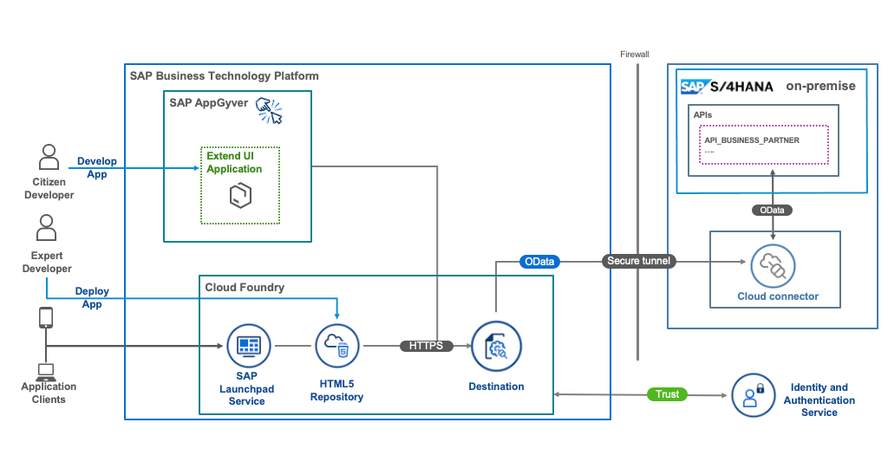

# Use SAP AppGyver to Build Side-by-Side UI Extensions for SAP S/4HANA

The main focus of this mission is to develop a custom UI application, which consumes an OData service from an SAP S/4HANA Cloud system.

We will create a simple custom UI application using no-code tool **SAP AppGyver**, push the code to the HTML5 repository and show different options on how to expose this application - as a stand-alone or with the different SAP Launchpads environments.

## Business Scenario

As a sample scenario, Jane a sales executive of ACME Corporation regularly meets different customers. She needs access to latest customer information on the go. She needs a simplified web application, which can run on a portable device like smartphone or a tablet.

ACME Corporation implements the application as an SAP S/4HANA Cloud extension on SAP Business Technology Platform (SAP BTP). This application is created with SAP AppGyver, a no-code user interface development tool.

This scenario covers:

* Building application with SAP AppGyver
* Set up connectivity between SAP BTP and SAP S/4HANA Cloud
* Deploying the application on SAP BTP, Cloud Foundry environment

## Solution Architecture

 

## Steps to do in workshop

1. [**Recommended Way**]: If you already have a SAP user, you can refer to the steps in SAP Discovery Center. 
   - Login to the Discovery Center with your SAP User and select **Start Mission** to start the mission: [SAP Discovery Center mission](https://discovery-center.cloud.sap/missiondetail/4024/4228/)
   - Choose tab **Project Board** to see the detailed step by step instructions.
   - In this workshop, we focus on **AppGyver Development** and we have setup the **Option 2 - Set Up With Mock Server** already for your usage.
   - Kindly start with the **Develop** section with the highlighted steps below.   
   - For the AppGyver development, select the pre-configured destination **appgyver_mock** or **bupa** which points to the running mock server.

     
     
 2. [**Alternative Way**] If you are not able to login to SAP Discovery center, execute the following steps:
    - [Create a No-Code Application with SAP AppGyver](https://github.com/SAP-samples/btp-s4hana-nocode-extension/blob/workshop/create-application/develop/README.md)
    - [Create a Business Partner List Page](https://github.com/SAP-samples/btp-s4hana-nocode-extension/blob/main/create-application/develop/ListPage/README.md)
    - [Create a Business Partner Details Page and Preview the application](https://github.com/SAP-samples/btp-s4hana-nocode-extension/blob/main/create-application/develop/DetailsPage/README.md)

## How to Obtain Support
1. For the support, ask us in the Workshop.
2. When you have issues later, you can ask **Questions** and get [Support](https://discovery-center.cloud.sap/missiondetail/4024/4228/?tab=support) through Discovery Center.
3. You can also [Create an issue](https://github.com/SAP-samples/btp-s4hana-nocode-extension/issues) in this repository if you find a bug or have questions about the content.

For additional support, [ask a question in SAP Community](https://answers.sap.com/questions/ask.html).

## Contributing

If you wish to contribute code, offer fixes or improvements, please send a pull request. Due to legal reasons, contributors will be asked to accept a DCO when they create the first pull request to this project. This happens in an automated fashion during the submission process. SAP uses [the standard DCO text of the Linux Foundation](https://developercertificate.org/).

## License

Copyright (c) 2022 SAP SE or an SAP affiliate company. All rights reserved. This project is licensed under the Apache Software License, version 2.0 except as noted otherwise in the [LICENSE](LICENSE) file.
