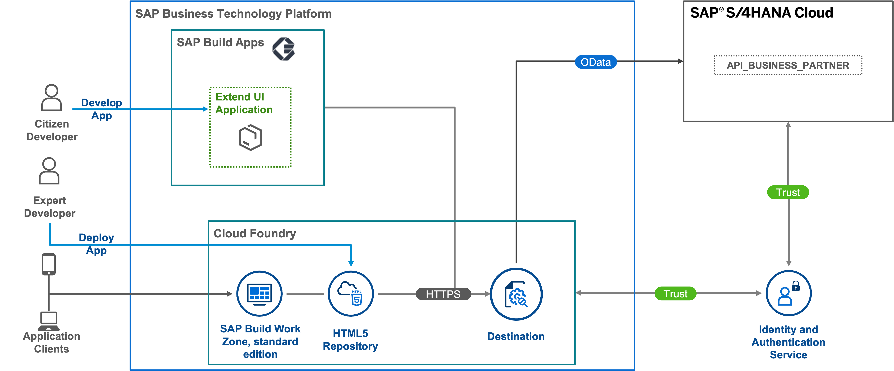

# Use SAP Build Apps to Build Side-by-Side UI Extensions for SAP S/4HANA

The main focus of this mission is to develop a custom UI application, which consumes an OData service from an SAP S/4HANA system.

We will create a simple custom UI application using no-code tool **SAP Build Apps**, push the code to the HTML5 repository and show different options on how to expose this application - as a stand-alone or with the different SAP Build Work Zone environments.

You can find this scenario as a mission in [SAP Discovery Center](https://discovery-center.cloud.sap/missiondetail/4024/4228/).

## Business Scenario

As a sample scenario, Jane a sales executive of ACME Corporation regularly meets different customers. She needs access to the latest customer information on the go. She needs a simplified web application, which can run on a portable device like smartphone or a tablet.

ACME Corporation implements the application as an SAP S/4HANA extension on SAP Business Technology Platform (SAP BTP). This application is created with SAP Build Apps, a no-code user interface development tool.

This scenario covers:

* Building application with SAP Build Apps
* Set up connectivity between SAP BTP and SAP S/4HANA Cloud or SAP S/4HANA on-premise
* Deploying the application on SAP BTP, Cloud Foundry environment

## Solution Architecture

**SAP S/4HANA Cloud**

 

### Start Discovery Center Mission 
- Login to the Discovery Center with your SAP User and select **Start Mission** to start the mission: [SAP Discovery Center mission](https://discovery-center.cloud.sap/missiondetail/4024/4228/)
- Choose tab **Project Board** to see the detailed step by step instructions. 
- Learn the cards in the **Discover** section

## Discover

* [The Mission Story](discover/business-story.md)
* [Learn the Basics of SAP BTP](https://github.com/SAP-samples/cloud-extension-html5-sample/blob/mission/mission/discover/BTP.md)
* [Learn About SAP S/4HANA](https://github.com/SAP-samples/cloud-extension-html5-sample/blob/mission/mission/discover/S4H.md)
* [Learn About SAP S/4HANA Cloud](./discover/S4HC.md)
* [Learn About HTML5 Applications](https://github.com/SAP-samples/cloud-extension-html5-sample/blob/mission/mission/discover/HTML5.md)
* [Learn About SAP Build Apps](./discover/AppGyver.md)
* [Learn About SAP Cloud Identity Services](https://github.com/SAP-samples/cloud-extension-html5-sample/blob/mission/mission/discover/IAS.md)
* [Learn About SAP Work Zone](https://github.com/SAP-samples/cloud-extension-html5-sample/blob/mission/mission/discover/Launchpad.md)

  
## Landscape Setup for SAP BTP and Mock Server

- For the workshop, a SAP BTP subaccount is precreated for you
- You are provided with an user and initial password for the custom Identity & Authentication Tenant which is configured to the subaccount.
- You will login to the SAP BTP cockpit and to the SAP Build Apps using your custom Identity user name and password.
- A mock server is deployed and already running in the SAP BTP subaccount. This mock server will act like an SAP S/4HANA backend giving the data for [Business Partners API](https://api.sap.com/api/API_BUSINESS_PARTNER/overview)
- A SAP BTP destination is also preconfigured for you with the name **bupa**

## Implementation of an SAP Build Apps Extension Application

Now that the landscape is all setup, let us learn to build an application using SAP Build Apps. You will also learn to preview the application, deploy the application to the SAP BTP-managed HTML5 repository and to integrate the application in the SAP Build Work Zone, standard edition. 

* Develop a simple UI application:
  * [Create a No-Code Application with SAP Build Apps](./create-application/develop/README.md)
  * [Create a Business Partner List Page](./create-application/develop/ListPage/README.md)
  * [Create a Business Partner Details Page](./create-application/develop/DetailsPage/README.md)
  * [Build and Deploy Your SAP Build Apps Application to SAP BTP](./create-application/deploy/README.md)
  * [Integrate the Application with SAP Build Work Zone, standard edition](./create-application/workzone/README.md)

## How to Obtain Support

[Create an issue](https://github.com/SAP-samples/btp-s4hana-nocode-extension/issues) in this repository if you find a bug or have questions about the content.

For additional support, [ask a question in SAP Community](https://answers.sap.com/questions/ask.html).

## Contributing

If you wish to contribute code, offer fixes or improvements, please send a pull request. Due to legal reasons, contributors will be asked to accept a DCO when they create the first pull request to this project. This happens in an automated fashion during the submission process. SAP uses [the standard DCO text of the Linux Foundation](https://developercertificate.org/).

## License

Copyright (c) 2022 SAP SE or an SAP affiliate company. All rights reserved. This project is licensed under the Apache Software License, version 2.0 except as noted otherwise in the [LICENSE](LICENSE) file.
