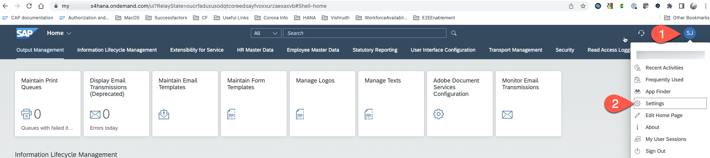
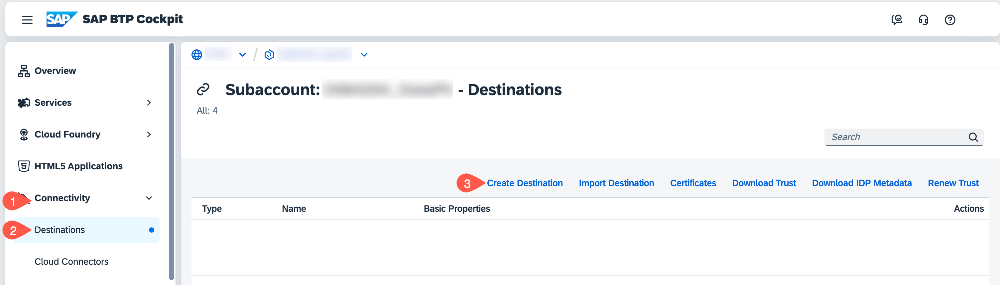

# Configure End-to-End Connection from SAP BTP to SAP S/4HANA Cloud

## Introduction

In this section, you wil configure the end-to-end communication between the SAP S/4HANA Cloud system and the SAP BTP subaccount so that a Web app running in the SAP BTP subaccount can consume an OData service running on the SAP S/4HANA Cloud system. Having already configured the SAP S/4HANA Cloud system, all you need to do is define an appropriate destination on SAP BTP.

See section [User Propagation from the Cloud Foundry Environment to SAP S/4HANA Cloud](https://help.sap.com/docs/CP_CONNECTIVITY/cca91383641e40ffbe03bdc78f00f681/9af03a067bf74457ba0de0221b9cc72a.html) on SAP Help Portal for more details.

### Preparation

1. Log in to the SAP S/4HANA Cloud system with your administrator e-mail and password.

2. Search for application **Communication Arrangement** and open the Communication Arrangement, which you have created in the previous section [Configure Communication Settings in S/4HANA Cloud](./setup/s4hc-setup/setup-s4hc-system.md).

3. In **Inbound Services**, copy the **Service URL** of the **Business Partner (A2X)** with **Application Protocol**, **OData V2** to a text editor of your choice. This OData V2 URL is used for configuring SAP BTP Destination.

   

4. In **Inbound Communication**, choose **OAuth 2.0 Details**.

   

6. Copy the following values to a text editor of your choice:
   - Copy the inbound communication **User Name** to a text editor of your choice. This value is used for fields **Client Key** and **TokenServiceUser** in the next step.
   - Copy the value of **Token Service URL**.
   - Copy the value of **SAML2 Audience**, which is used for field **Audience** in the next step.
   - Copy the value of **OAuth 2.0 Scope ID**.

     

## Create a Destination on SAP BTP

1. In **SAP BTP Cockpit**, navigate to your subaccount.

2. From your left-side subaccount menu, navigate to **Connectivity** &rarr; **Destinations**.

   

3. Choose **New Destination** to create a new destination or you can choose **Import Destination** to import the sample destination file [s4hCloudOauth](./images/s4hCloudOauth).

4. Configure the **Destination** by entering or adjusting the following values:

   * **Name**: a meaningful name, for example: s4hCloudOauth

   * **Type**: HTTP

   * **URL** Paste the value of the OData URL, which you copied from the preparation step, for example: https://myXXXXXX-api.s4hana.ondemand.com/sap/opu/odata/sap/API_BUSINESS_PARTNER.

   * **ProxyType** Internet

   * **Authentication** OAuth2SAMLBearerAssertion

   * **Audience** https://myXXXXXX.s4hana.ondemand.com. This is the URL of your SAP S/4HANA Cloud account.

   * **AuthnContextClassRef** urn\:oasis\:names\:tc\:SAML\:2.0\:ac\:classes\:X509

   * **Client Key** Enter the name of the inbound communication user that you created in the S/4HANA Cloud system

   * **TokenServiceURLType** Dedicated

   * **TokenServiceURL** https://myXXXXXX-api.s4hana.ondemand.com/sap/bc/sec/oauth2/token

   * **TokenServiceUser** Enter the name of the inbound communication user that you created in the S/4HANA Cloud system

   * **Token Service Password** Enter the password of the inbound communication user, which you have copied to the text editor while creating the user in the S/4HANA Cloud system

5. Add the following properties by choosing the **New Property** button. If you have imported the sample destination file, the following properties are automatically added:

   * Name: **HTML5.DynamicDestination** - value: **true**

   * Name: **nameIdFormat** - value: **urn\:oasis\:names\:tc\:SAML\:1.1\:nameid-format\:emailAddress**

   * Name: **scope** - value: **API_BUSINESS_PARTNER_0001**

   * Name: **userIdSource** - value: **email**

   * Name: **WebIDEAdditionalData** - value: **full_url**

   * Name: **WebIDEEnabled** - value: **true**

   * Name: **WebIDEUsage** - value: **odata_gen**

6. Check **Use default JDK truststore**.

7. **Save** your settings.

   

## Summary

You have created a destination in the SAP BTP subaccount that can be used by SAP AppGyver to do SSO and user propagation.
