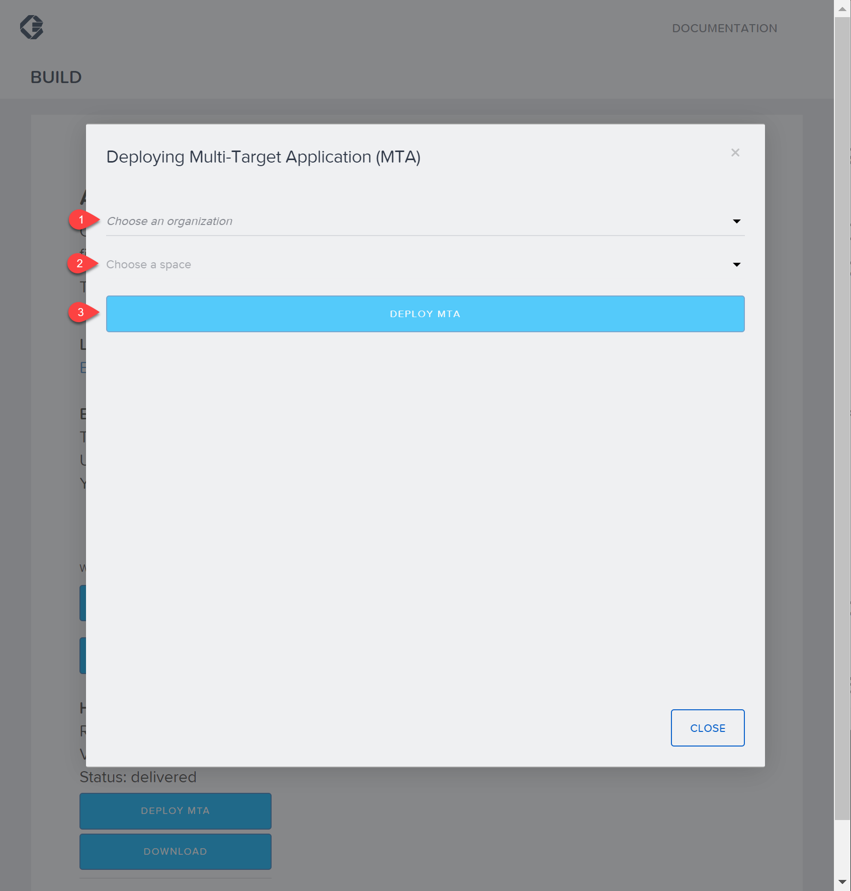
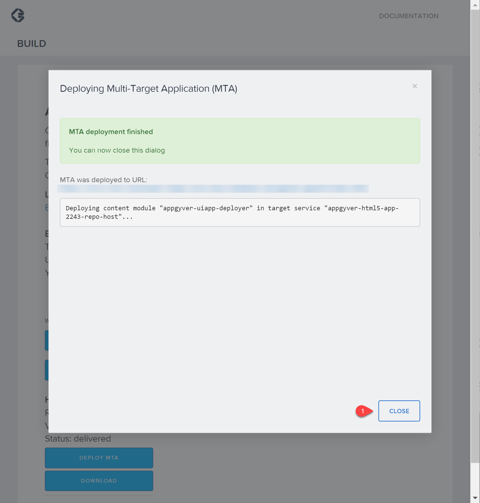

# Build and Deploy Your SAP Build Apps Application to SAP BTP

## Introduction

In this section you will build the application that you created using SAP Build Apps, and then deploy it to SAP BTP as an HTML5 application.

**Persona:** Citizen Developer

**Abbreviation:** SAP Business Technology Platform = SAP BTP

## Step-by-Step

### Build

1. In **Application Development** choose **LAUNCH**.

2. Choose **OPEN BUILD SERVICE**.

   

3. Under **Web App**, choose **CONFIGURE**.

   

5. On **Bundle Settings** tab, choose **MTAR** and then choose **SAVE & NEXT**.

   

6. On **Image Assets** tab, choose **NEXT**.

7. On **Plugins**, choose **NEXT**.

   

8. In the **Web App** section, choose **BUILD**.

   

9. Choose file type **MTAR**.

10. Choose the latest runtime version.

11. Enter a version number, for example, **0.0.1**.

12. Choose **BUILD**.

    

    The Build page will not notify via e-mail once the build has been completed. You have to refresh the browser to check if the build has been completed. The build can take more than 10 minutes.

13. Refresh the browser until the status changes from **created** to **queued** and then finally to **delivered**, at which point a **DEPLOY MTA** button appears. This can take several minutes.

    
     

### Deploy

1. In **Web App** choose **DEPLOY_MTA**.
   
   You will need to authorize with your identity provider the first time you do this.

3. Select the organization and space and then choose **DEPLOY_MTA**.

    

4. Wait until the deployment is completed and choose **CLOSE**.

    

### Check Deployment

1. In **SAP BTP Cockpit**, navigate to your subaccount.

2. From the left-side subaccount menu navigate to **HTML5 Applications**.

3. Under **Managed Application Router provided by SAP Build Work Zone, standard edition**, you will find a list of applications.

   

4. Click the **Application Name** (this will be the build number).

5. Your application opens. Depending on how your subaccount is configured, you might need to choose the IAS and login.

## Summary

You have deployed the application that you developed in SAP Build Apps to SAP BTP as an HTML5 application that can be consumed using a URL.
