# Build and Deploy Your SAP Build Apps Application to SAP BTP

## Introduction

In this section you will build the application that you created using SAP Build Apps, and then deploy it to SAP BTP as an HTML5 application.

**Persona:** Citizen Developer

**Abbreviation:** SAP Business Technology Platform = SAP BTP

## Step-by-Step

### Build

1. In **Application Development** choose **LAUNCH**.

2. Choose **OPEN BUILD SERVICE**.

   

3. Choose **Create Configuration**

   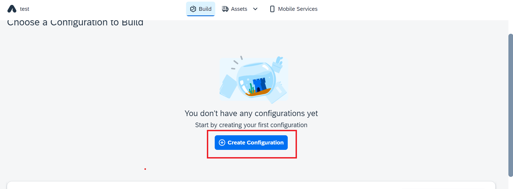

4. Select **SAP Builld Workzone** as a target platform

   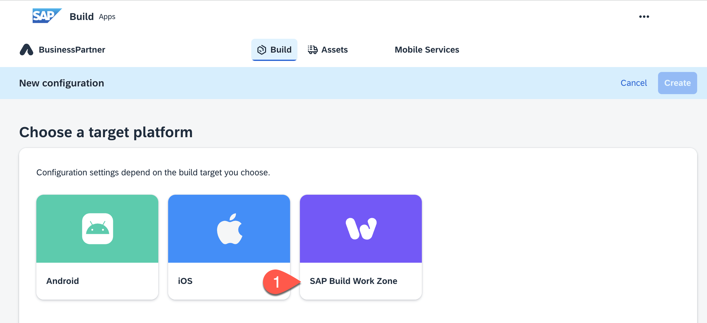

5. Give a Name for the configuration e.g. *BusinessPartners* and choose **Create**

   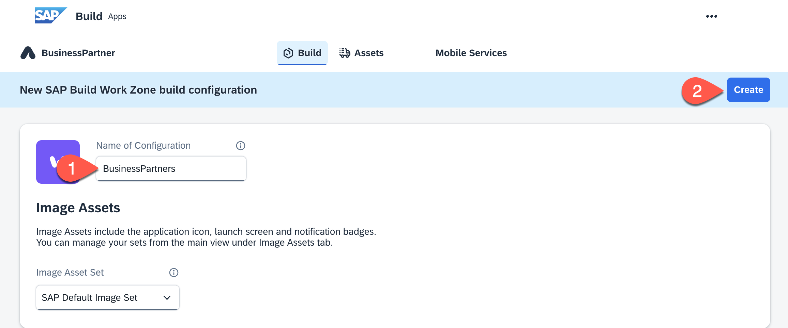

6. Back in the configuration page, choose **...** from your newly build configuration

   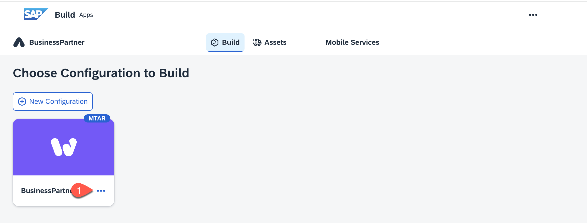

7. In the pop-up choose a Build Process Number e.g. *0.0.1* and choose **Build**

   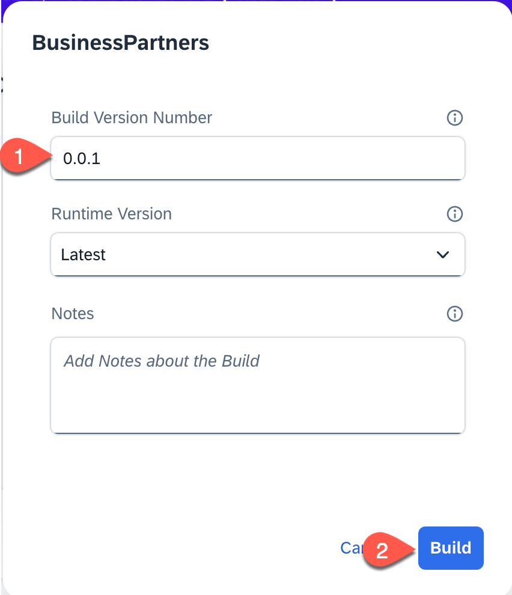

8. In the Build History you can see your build with the status *Building*

   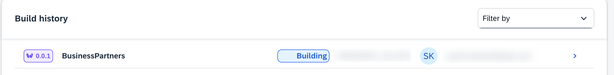

9. As soon as your build is status *Delivered* click on line to open Build Details

   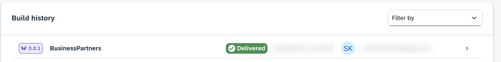

10. Choose **Deploy** to deploy your application

   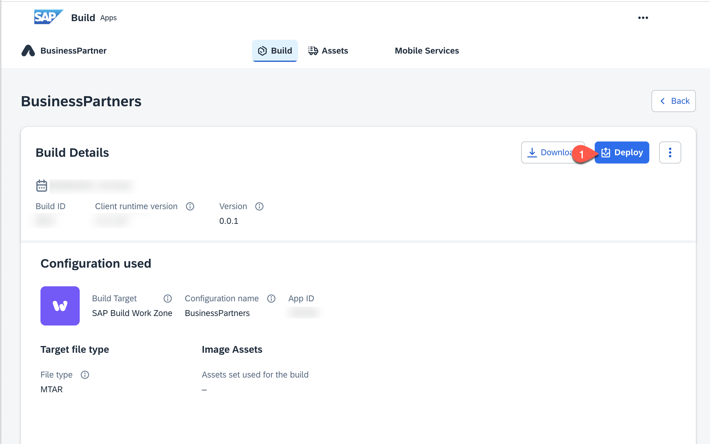

11. In the pop-ip, choose the API endpoint of your subaccount

> Hint: You can find the API endpoint in the overview section of your  of your subaccount

12. In case you are not logged in yet, choose **Login with BTP**

   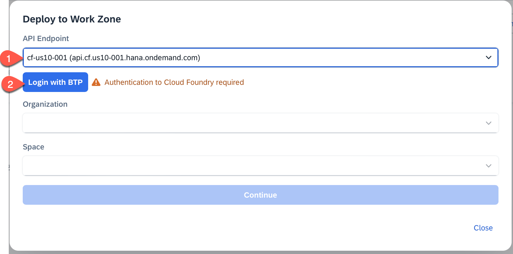

13. In the pop-up choose **Sign in the the default identity provider**

   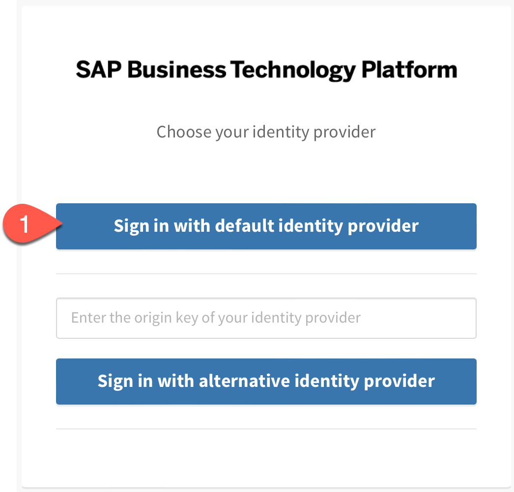

14. Back in the **Deploy to Work Zone** view choose your **Organization** and **Space**

> Hint: You can find the Organization and Space in the overview section of your  of your subaccount

15. Choose **Continue**

   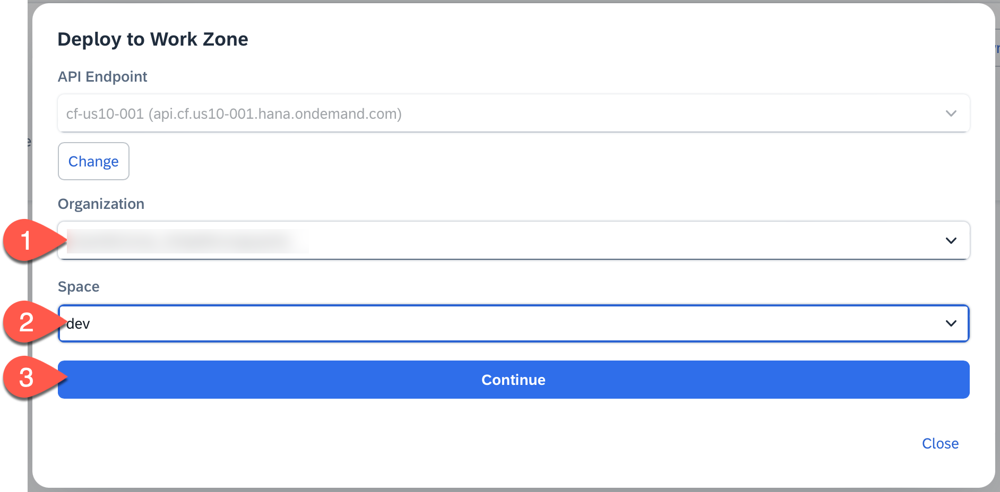

16. Your application in now being deployed. This can take up to 5 minutes. As soon as the status is 'Your web build is now live at' you can click on the link to open your app.

   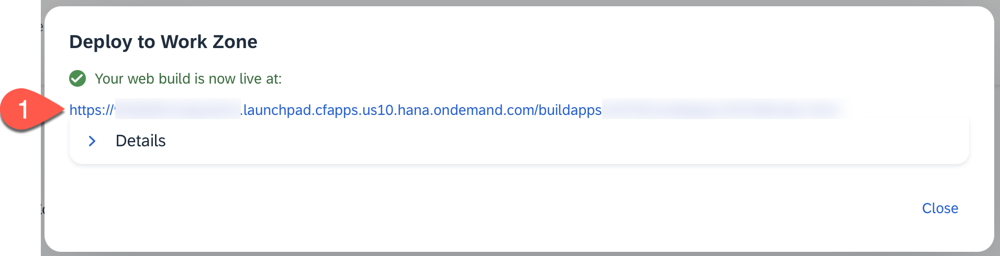

### Check Deployment

1. In **SAP BTP Cockpit**, navigate to your subaccount.

2. From the left-side subaccount menu navigate to **HTML5 Applications**.

3. Under **Managed Application Router provided by SAP Build Work Zone, standard edition**, you will find a list of applications.

4. Click the **Application Name** (this will be the build number).

   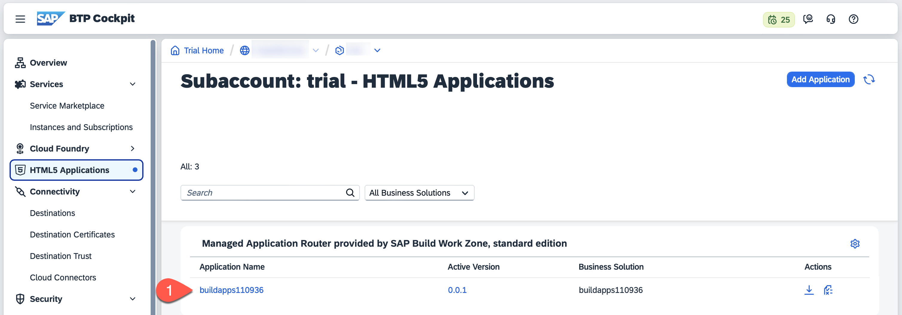

5. Your application opens. Depending on how your subaccount is configured, you might need to choose the IAS and login.

## Summary

You have deployed the application that you developed in SAP Build Apps to SAP BTP as an HTML5 application that can be consumed using a URL.
