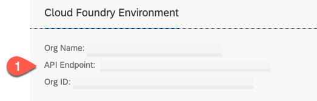

# Build and Deploy Your SAP AppGyver Application to SAP BTP

## Introduction

In this section, you will build and deploy your SAP AppGyver UI application, which was already created using SAP AppGyver.

**Persona:** SAP BTP Expert Developer

**Abbreviation:** SAP Business Technology Platform = SAP BTP


## Step-by-Step

### Build

1. In **Application Development** choose **LAUNCH**.

2. Choose **DISTRIBUTE**. Choose **OPEN BUILD SERVICE**.

   

3. Under **Web App**, choose **CONFIGURE**.

   

4. Enter a hostname and choose **SAVE & NEXT**.

   

5. On **Bundle Settings** tab, choose **MTAR** and then choose **SAVE & NEXT**.

   

6. On **Image Assets** tab, choose **SAVE & NEXT**.

7. On **Permissions**, choose **SAVE & NEXT**.

   

8. In the **Web App** section, choose **BUILD**.

   

9. Choose file type **MTAR**.

10. Choose the latest runtime version.

11. Enter a version number, for example, **0.0.1**.

12. Choose **BUILD**.

    

    The Build page will not notify via e-mail once the build has been completed. You have to refresh the browser to check if the build has been completed. The build can take more than 10 minutes.

13. Refresh the browser until the status changes from **created** to **queued** and then finally to **delivered**, at which point a **Download** button appears. This can take several minutes.

14. In **Web App** tab choose **DOWNLOAD**.

    

    An MTAR file is downloaded. It will look like this: **app-97087_web_standalone_mtar_build-2714.mtar**.

### Push to HTML5 Repository

Use the Cloud Foundry Command Line Interface (CLI) to deploy to the SAP BTP subaccount. You will use version 8 and depending on how you have installed it, the command is either **cf** or **cf8**. See [Install the Cloud Foundry Command Line Interface (CLI)](https://developers.sap.com/tutorials/cp-cf-download-cli.html) if you do not already have it.

1. Check that the multiapps plugin is installed:

   ```
   cf8 plugins
   ```

2. If the plugin is not installed, install it using:

   ```
   cf8 install-plugin multiapps
   ```
3. Set the SAP BTP API endpoint. You can find it in overview of your SAP BTP subaccount:

    

    ```cmd
    cf8 api <your-api endpoint>
    ```

4. Log in to your subaccount and select your org and space:

   ```cmd
   cf8 login -u <your-user> -p <your-password>
   ```

5. Change to the directory where the MTAR file is located and deploy it:

   ```
   cf8 deploy app-97087_web_standalone_mtar_build-2714.mtar
   ```

### Check Deployment

1. In **SAP BTP Cockpit**, navigate to your subaccount.

2. From the left-side subaccount menu navigate to **HTML5 Applications**.

3. Under **Managed Application Router provided by SAP Build Work Zone, standard edition**, you will find a list of applications.

   

4. Click the **Application Name** (this will be the build number).

5. Your application opens. Depending on how your subaccount is configured, you might need to choose the IAS and login.

## Summary

You have deployed the application that you developed in SAP AppGyver to SAP BTP as an HTML5 application that can be consumed using a URL.


