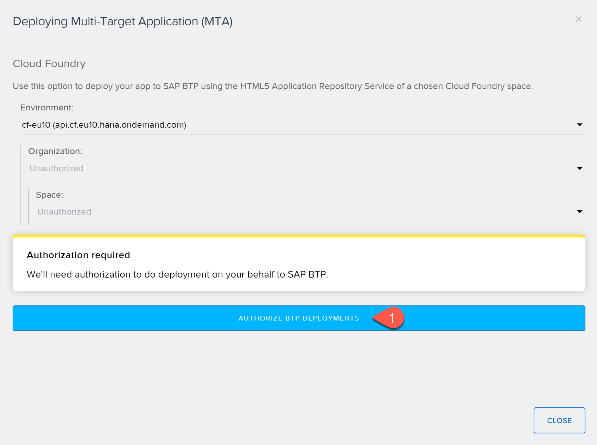
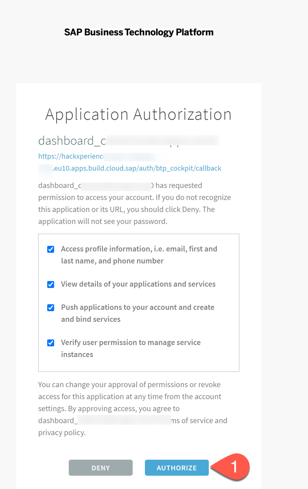
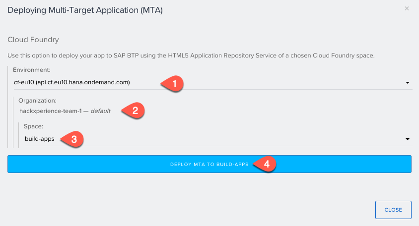
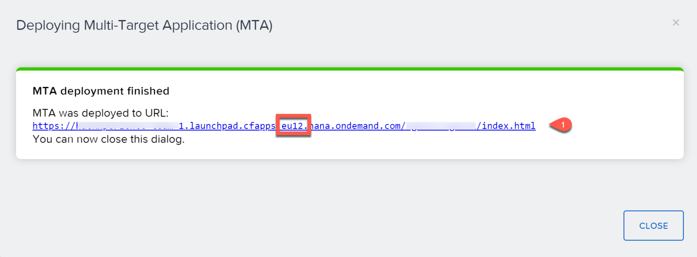

# Build and Deploy Your SAP Build Apps Application to SAP BTP

## Introduction

In this section you will build the application that you created using SAP Build Apps, and then deploy it to SAP BTP as an HTML5 application.

**Persona:** Citizen Developer

**Abbreviation:** SAP Business Technology Platform = SAP BTP

## Step-by-Step

### Build your application

1. In **Application Development** choose **LAUNCH**.

2. Choose **OPEN BUILD SERVICE**.

   

3. Under **Web App**, choose **CONFIGURE**.

   

5. On **Bundle Settings** tab, choose **MTAR** and then choose **SAVE & NEXT**.

   

6. On **Image Assets** tab, choose **SAVE & NEXT**.

7. On **Permissions**, choose **SAVE & NEXT**.

   

8. In the **Web App** section, choose **BUILD**.

   

9. Choose file type **MTAR**.

10. Choose the latest runtime version.

11. Enter a version number, for example, **0.0.1**.

12. Choose **BUILD**.

    

    The Build page will not notify via e-mail once the build has been completed. You have to refresh the browser to check if the build has been completed. The build can take more than 10 minutes.

13. Refresh the browser until the status changes from **created** to **queued** and then finally to **delivered**, at which point a **DEPLOY MTA** button appears. This can take several minutes.

    
     

### Deploy your application to the SAP BTP, Cloud Foundry environment

1. In **Web App** choose **DEPLOY_MTA**.
   
   You will need to authorize with your custom identity provider the first time you do this to allow deployments from SAP Build Apps to deploy to your Cloud Foundry Organization and space.
   
    
   
   
2. For this HackXperience workshop, enter the custom origin key as **dts-global-ias-platform** (as this custom IAS is configured as the trusted identity provider for logon and choose **Sign in with alternative identity provider**

   
       
   >**Note**: If you accidently select the default identity provider option, your SAP user with the default SAP Identity provider does not have **Space_Developer** rights to deploy to Cloud Foundry. Once you select an option, it is stored for a day and does not ask again to authorize. Currently you have to wait for a day until the CF session expires. Then you can again try the step 1-2 to try and authorize again. 

3. Choose **Authorize** to allow SAP Build Apps to push applications to the Cloud Foundry organization and space.

   
   
4. Select the Cloud Foundry Organization, Space for deployment. For this workshop, the API endpoint is **cf-eu10**, you can check the API enpoint of an subaccount in BTP Cockpit -> Subaccount -> Overview. Choose **Deploy MTA to DEV**
   

5. You can find the status of the deployment

   

6. You can find the URL of the deployed application. Copy the URL and replace **eu12** with **eu10** in the URL to open the right URL of the deployed application. (There is a bug currently which produces with the wrong endpoint, so you need this replacement to eu10 as our subaccount is in the EU10 landscape).

   

7. Alternatively, you can open the application from the list of **HTML5 Applications** in the SAP BTP cockpit as described in the next section below.

### Open HTML5 Application

1. In **SAP BTP Cockpit**, navigate to your subaccount.

2. From the left-side subaccount menu navigate to **HTML5 Applications**.

3. Under **Managed Application Router provided by SAP Build Work Zone, standard edition**, you will find a list of applications.

   

4. Click the **Application Name** (this will be the build number when you built your application in the previous step).

5. Your application opens, if you are asked with an authentication, enter the SAP email address and the password which you chose in the beginning of this exercise.

## Summary

You have deployed the application that you developed in SAP Build Apps to SAP BTP as an HTML5 application that can be consumed using a URL.
