## Details Page

After you have created the entry page of your application, you will now create a page to show the details of the selected business partner.

### Create a New Page

You will add a new page to your application and add page parameters so you can access data from your application.

1. On the top left section, choose the name of your current page **Home**, which is highlighted in light blue to open the page menu of SAP AppGyver.

2. Choose **ADD NEW PAGE**.

   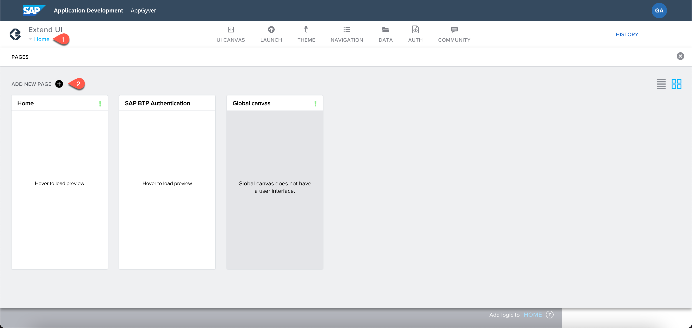

3. Choose **Details** as **Page name**. Your new page will be created and open.

4. On the Details page, choose the toggle button to switch to **VARIABLES** tab.

5. Choose the **PAGE PARAMETERS** button on the left side of the screen.

6. Choose **ADD PARAMETER**.

7. It creates a new parameter as a list entry, choose entry to edit.

8. On the right side of the screen, change the **Parameter name** to **businesspartnerId**.

9. Again, choose  **ADD PARAMETER** and select the new entry.

10. Change **Parameter name** to **businesspartnerName**.

11. Choose **Save**.

    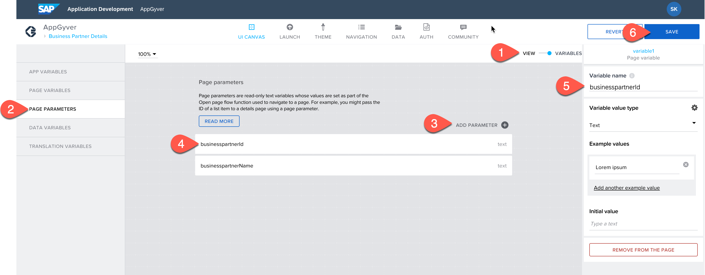

12. Switch back to **View** via the toggle button.

### Enable Navigation from Home Page to Details Page

To show the business partner details on the details page, you need to connect the **Home** page and the **Details** page. In this section, you will first create a new navigation logic to pass the page parameter created in the previous step.
On the details page, you will then load the business partner address by passing the business partner id to the **A_BusinessPartnerAddress** entity.

1. On the **home page**, select the first row in the list.

2. At the bottom of App Builder where you can see **Add logic to LIST ITEM1**. Choose the arrow to open the logic canvas.

   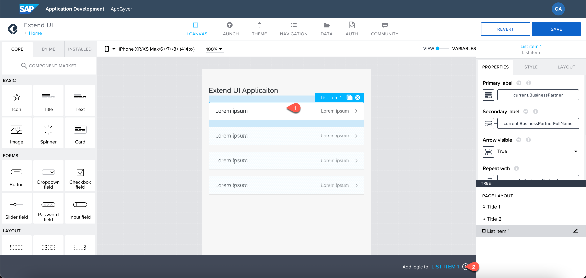

3. In the component menu on the left side, choose **Navigation** &rarr; **Open page** to add a function that opens a new page.

4. Drag and drop it to the Logic canvas.

5. Hover over the **Component Tab** and choose the round dot. Connect the dots of the **component tap** and the **open page** component. It creates a new connection setting the logic to open a new page.

   

6. Choose the open page component.

7. On the right side of the screen, select **PROPERTIES** &rarr; **Parameters** &rarr; **businessPprtnerId**.

8. Choose the **X** button. It opens a popup.

9. Select **Data item in repeat**.

10. Select **Current**.

11. Scroll the list and select **BusinessPartner**.

    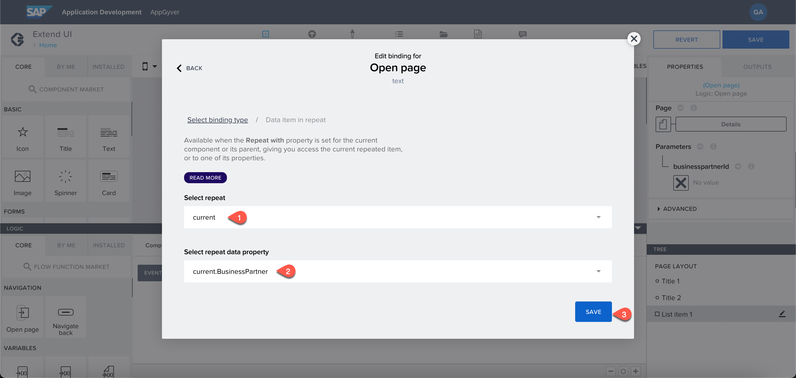

13. Repeat step 7-12 the **businesspartnerName** parameter and select **Current.BusinessPartnerFullName**.
With this step now, you can open a new page to show the business partner address by passing the business partner id to the **A_BusinessPartnerAddress** entity.

### Load Business Partner Address on the Details Page

The detail page receives the Business partner ID from the main page. In this step, the ID is used to get the address of the selected business partner.

1. From the left side of the screen, choose **Home**.

2. Select the **Details** page from there.

3. Toggle to the **VARIABLES** tab.

4. Select **DATA VARIABLES** on the left.

5. Choose **ADD DATA VARIABLE**.

6. Select **A_BusinessPartnerAddress** from the list.

7. Choose the **Filter Conditions** button on the right.

    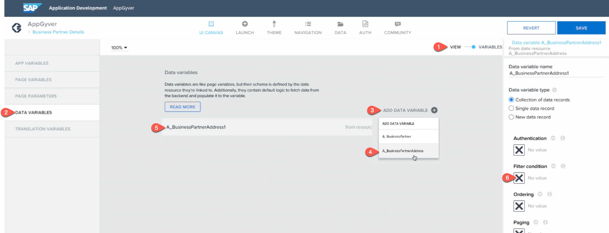

8. A popup opens. Select **Object with properties**.

      

9. In the **Property** dropdown, select **Business Partners**.

10. Under **Compared Value**, choose button **ABC**.

   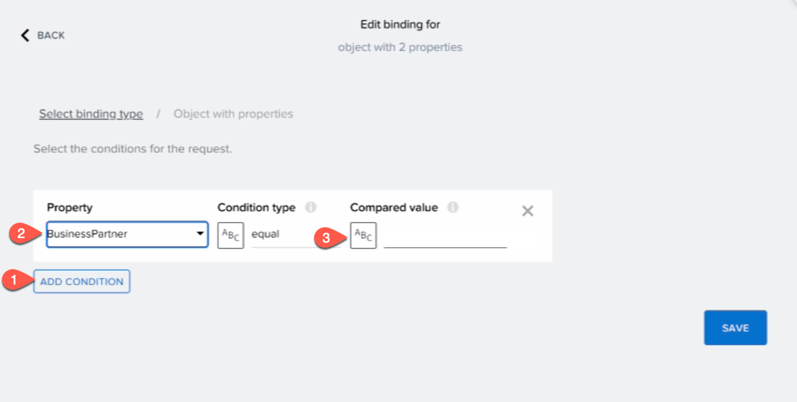

11. Select **Data and Variables**.

    

12. Select **Page Parameter**.

    

13. Select **businesspartnerid** and choose **Save**.

    

14. Choose the **SAVE** button to save changes to the page.

15. Toggle to the **VIEW** mode now.

Now, your application loads the business partner's address and stores it to the page variable.

### Display the Business Partner Name on the Details Page

Next, you will change the header of the details page, so it displays the current Business Partner.

1. Select the default description on the page and delete it by pressing **X**.

   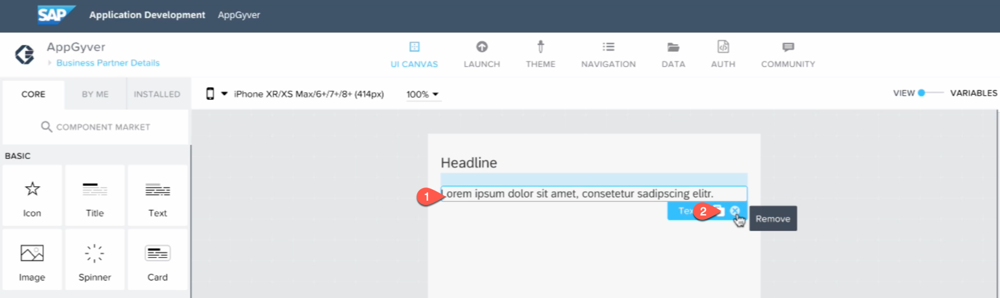

2. Select headline component. On the right side of the screen, choose **ABC** button in **Content** section.

   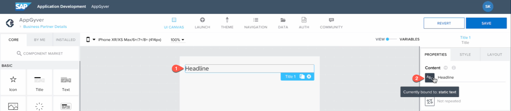

3. Select **Data and Variables**

   

4. Select **PageParameter**.

   

5. Select **businessPartnerName** and choose **Save**.

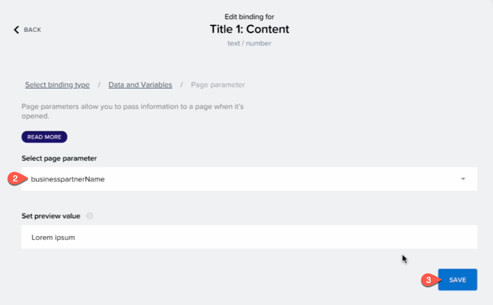

### Display Business Partner Addresses on the Details Page

Next, you will add a list element, which displays the address of the business partner.

1. Select **List item** in the component market on the left.

   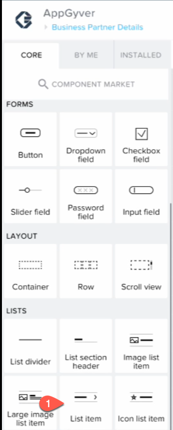

2. From the right **PROPERTIES** panel, find **Arrow Visible** section and select **false** from the dropdown.

3. Choose **Repeat with** the button on the left side of the screen.

  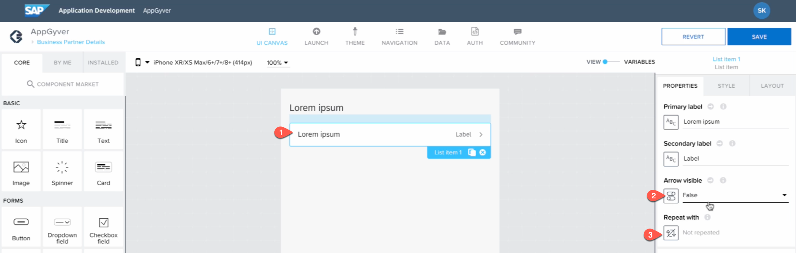

4. In the popup, select **Data and Variables** &rarr; **Data and Variable**.

  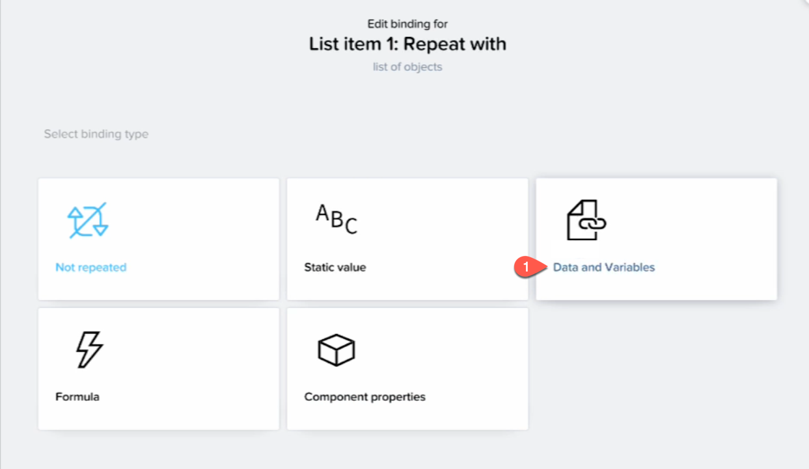

5. Select **A_BusinessPartnerAddress1** from the list.

6. Choose **Save**.

   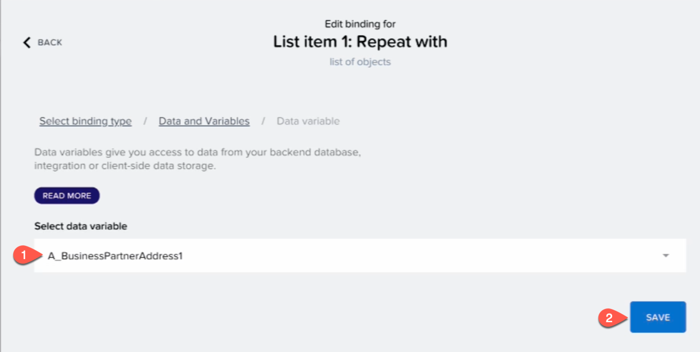

7. On the right side of the screen, choose **ABC** button under **Primary Label**.

8. Select **Data item in repeat**.

   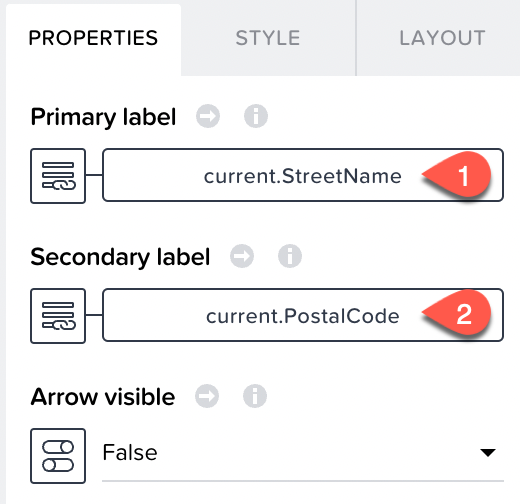

9.  Choose **Current**.

10. Scroll and select **Street Name**. Choose **Save**.

   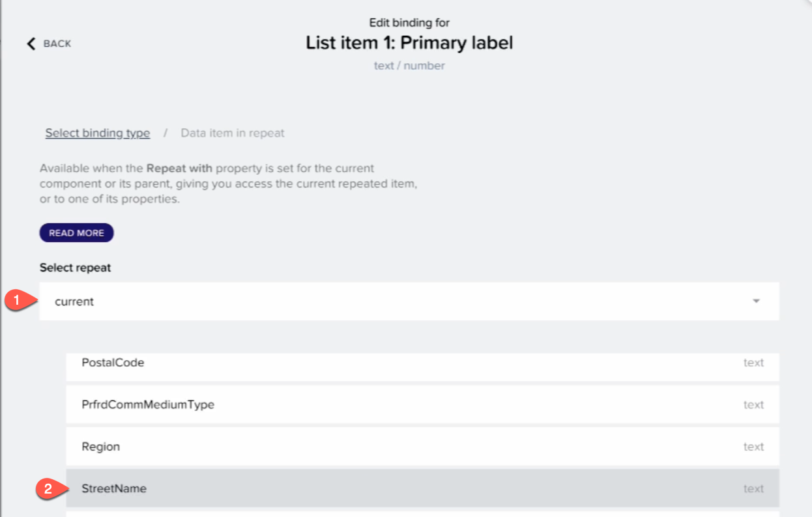

11. On the right side of the screen, Choose **ABC** button under the **Secondary Label**.

12. Select **Data item in repeat**.

   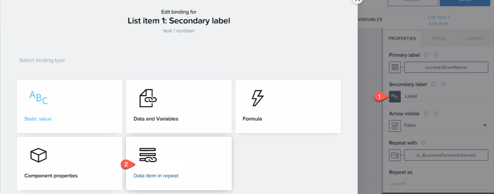

13. Choose **Current**.

14. Scroll and select **Postal Code**. Choose **Save**.

     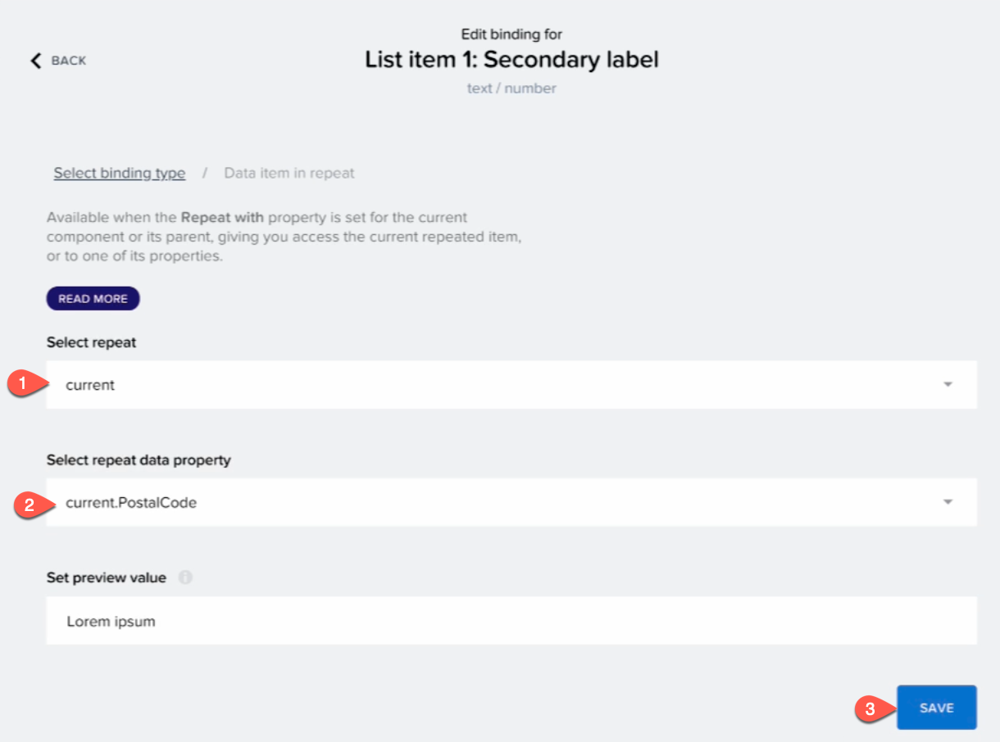

15. Choose **SAVE**.

Now, that your app is developed, Let's preview the application.

### Preview Your Application

1. Choose **LAUNCH**.

2. Choose **OPEN APP IN PREVIEW PORTAL**.

   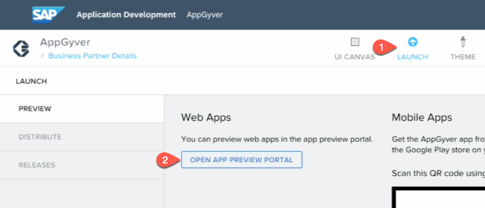

3. Select your application and choose **OPEN**.

   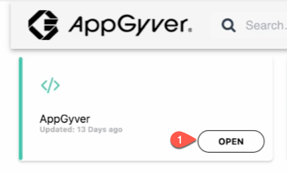

4. Choose the list item to see the details page.

5. The main page should look like:

   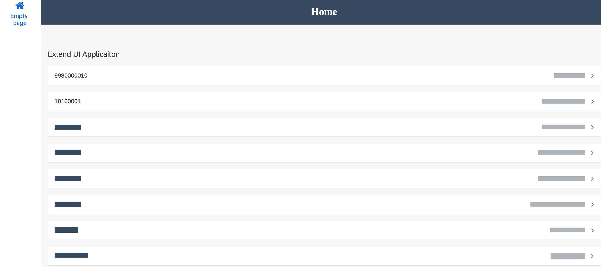

6. The details page should look like:

   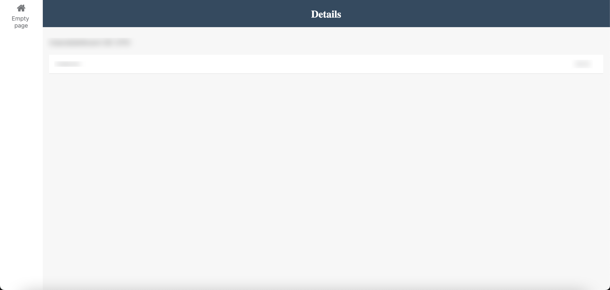

