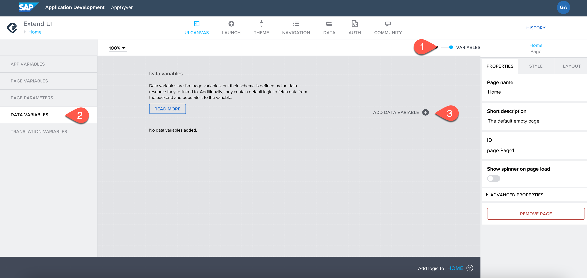

## Create a Business Partner List Page

To create the page displaying the list of business partners, you need to first create a **Data variable**.

#### Data Variable

A data variable is essentially the same as a page variable that exists in the context of the current page that is not accessible from other pages, and disappears if the page is removed from the navigation stack. The difference is that it gets its schema from the data resource it points to, and it comes with included default logic.

### Creating a Data Variable

1. From the UI canvas, choose the toggle button to switch from **View to variable**.

2. Choose **DATA VARIABLES** on the left side of app builder.

3. Now, choose **ADD DATA VARIABLE** and select **A_BusinessPartner**.

   

4. Choose **SAVE**.

Now that the data variable is created, toggle back to the **VIEW** mode.

### Creating a Business Partner List

At this step, you are creating a Business Partner List page in app builder.
#### Check That the Data Is Visible in the UI

1. On the left panel of UI CANVAS, you see the **Component Market**, scroll to the **Lists** section and choose **List Item**.

   

2. Drag the list to the application's page.

3. On the right side **PROPERTIES** section, scroll to **Repeat With**.

4. A popup opens. Select **Data and Variables.**

    

5. Select **A_BusinessPartner1** from the list and choose **SAVE**.

#### Bind the Data Variable to the List

1. Choose the list.

2. Go to **PROPERTIES**.

3. Choose Primary Label **ABC**.

    

4. Choose **Data item in repeat**.

5. Choose **Current**.

6. Select **Business Partner** scroll and choose **SAVE**.

    

7. Go to **PROPERTIES**.

8. Choose Secondary Label **ABC**.

9. Choose the **Data item in repeat**.

10. Choose **Current**.

11. Select **Business Partner Full Name**.

12. Choose **SAVE**.

It adds the data variable to the list.

### Preview the Application

1. Choose **LAUNCH**.

2. Choose **OPEN APP IN PREVIEW PORTAL**.

3. A new tab opens. Select the application you have created.

4. The application is launched in the preview portal.

    

The application's first page is now displayed.

