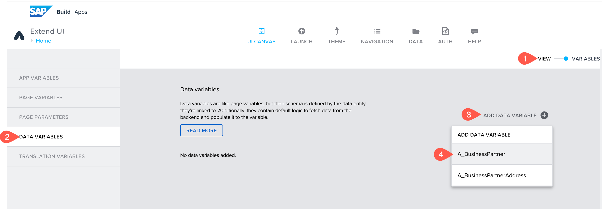
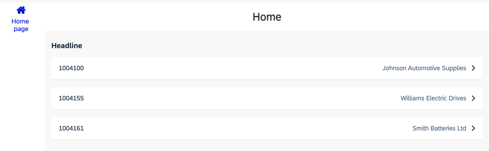

## Create a Business Partner List Page

To create the page displaying the list of business partners, you need to first create a **Data variable**.

#### Data Variable

A data variable is essentially the same as a page variable that exists in the context of the current page that is not accessible from other pages, and disappears if the page is removed from the navigation stack. The difference is that it gets its schema from the data resource it points to, and it comes with included default logic.

### Creating a Data Variable

Let us create a data variable to store the results of the business partner data coming from the data source.

1. From the UI canvas, choose the toggle button to switch from **View to variable**.

2. Choose **DATA VARIABLES** on the left side of app builder.

3. Now, choose **ADD DATA VARIABLE** and select **A_BusinessPartner**.
  
    

4. Choose **SAVE**.

Now that the data variable is created, toggle back to the **VIEW** mode.

### Creating a Business Partner List

At this step, you are creating a Business Partner List page in app builder.
#### Check That the Data Is Visible in the UI

1. On the left panel of UI CANVAS, you see the **Component Market**, scroll to the **Lists** section and choose **List Item**.

   

2. Drag the list to the application's page.

3. On the right side **PROPERTIES** section, scroll to **Repeat With** and select it.

   

4. A popup opens. Select **Data and Variables.**

   

5. Select **A_BusinessPartner1** from the list and choose **SAVE**.
6. Now you have configured that the list gets populated with the data variable which gets business partner data from the backend system.

#### Select the display fields for the List

Let us now define what fields we would like to show in the UI in the business partners list.

1. Choose the list.

2. Go to **PROPERTIES**.

3. Choose Primary Label **ABC**.

    

4. Choose **Data item in repeat**.

5. Choose **Current**.

6. Select **Business Partner** scroll and choose **SAVE**.

    

7. Go to **PROPERTIES**.

8. Choose Secondary Label **ABC**.

9. Choose the **Data item in repeat**.

10. Choose **Current**.

11. Select **Business Partner Full Name**.

12. Choose **SAVE** to add the data variable to the list.

13. Choose **SAVE** to save the changes in the application.

### Preview the Application

1. Choose **LAUNCH**.

2. Choose **OPEN APP IN PREVIEW PORTAL**.

3. A new tab opens. Select the application you have created.

4. The application is launched in the preview portal.

    

The application's first page is now displayed.

