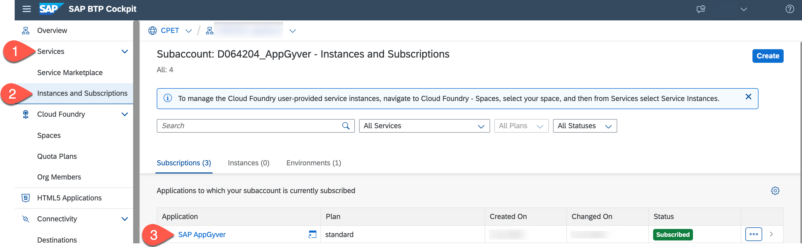
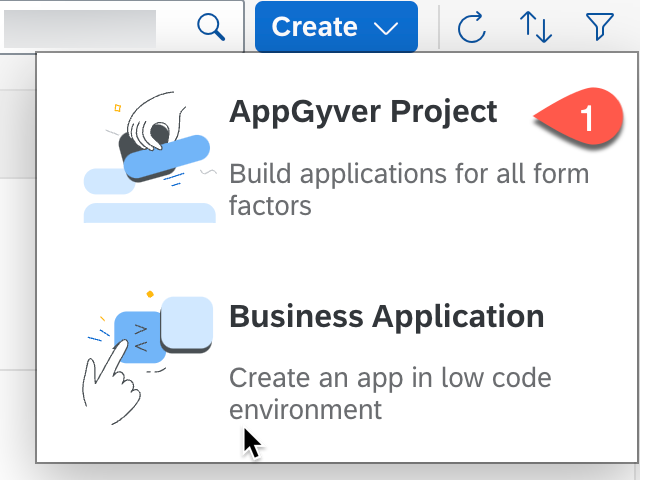
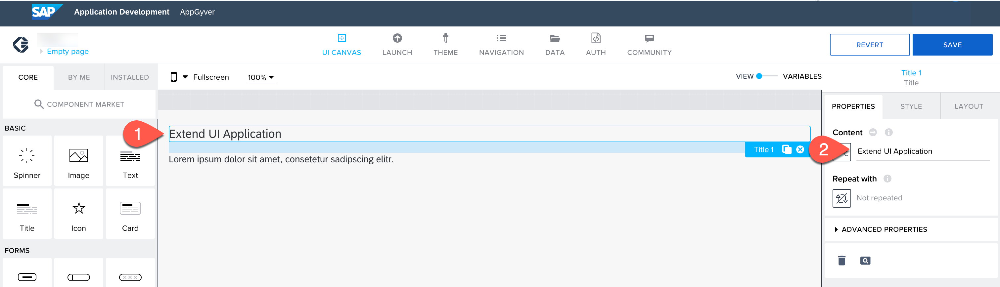
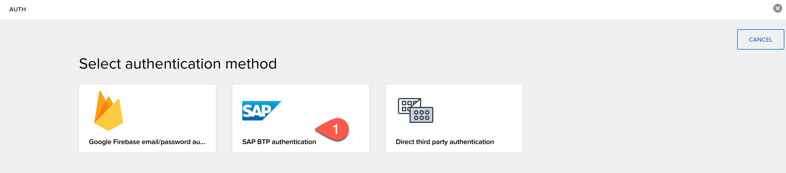

# Developing a No-Code Application with SAP AppGyver

In this section, you will create an SAP AppGyver application.

**Persona:** Citizen Developer

**Abbreviation:** SAP Business Technology Platform = SAP BTP

## Open SAP AppGyver

1. In **SAP BTP Cockpit**, navigate to your subaccount.

2. From the left-side subaccount menu navigate from **Services** &rarr; **Instances and Subscriptions**.

3. In the tab **Subscriptions**, find **SAP AppGyver** and choose **Go to Application** to open the entry page for Application Development.

   

4. You would be prompted with a log in screen of either default Identity Provider or custom Identity Provider depending on what you have configured.

5. Log in to the Application using your default/custom Identity Provider credentials.

## Create an Application Using SAP AppGyver

### Create a Project

1. On Application Development site choose **Create**, and choose **AppGyver Project** in the dropdown.

   

2. Enter a **Project Name**.

3. Enter a **Short Description**.

4. Choose **Create**.

   

5. Your created project will be opened in [App Builder](https://docs.appgyver.com/docs/quick-start#using-the-app-builder), which is the central page to build your application including a user interface, logic, as well as data integration.

6. Choose **Headline**.

7. Find the **Properties** tab in the menu on the right to change the content of the title. Choose **Content** and change the content from **Headline** to **Extend UI Application**.

   

8. Find the text field in the UI canvas in the center of your screen and choose **x** to remove this component.

9. Choose the blank page. On the right side under the **Properties**, choose **Page name**.

10. Change the page name to **Hom**.

    

### Enable Authentication

To consume data from your SAP S/4HANA Cloud System that is configured as a data source in the previous section, you need to enable authentication.

1. Choose **AUTH** at the top section of the app builder.

2. Choose **Enable Authentication**.

   

3. Select **SAP BTP Authentication** and choose **Ok**. This enables authentication for the project.

   

### Add a Data Source

To add a data source, you need to add the following steps to your project.

1. Choose **Data** at the top of app builder.

2. Find section **No systems integrated** and choose **Add Integration**.

   

3. On the next screen **SAP Systems**, select **BTP Destinations**.

4. Select the destination that you have created in the previous section from the list.

5. Under the **Data entities**, select **Search** and enter **A_BUSINESSPARTNER**.

6. Choose **Install Integration**.

   

7. After installing integration, you'll see **Enable Data Entity**. Select the entry to choose.

8. Now, search for **A_BusinessPartnerAddress** and choose **Enable Data Entity**.

9. Choose **Save** at top of the app builder. This adds the data source to your project. Choose **UI Canvas** to go back to the UI designer view.
