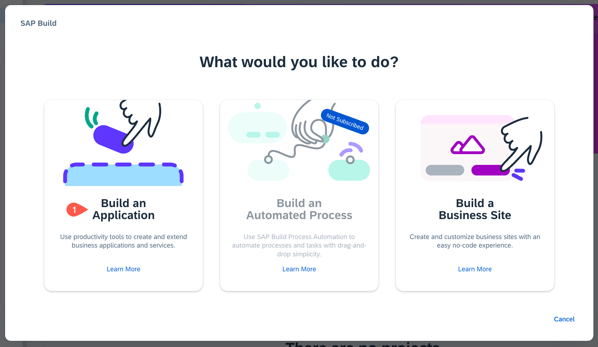
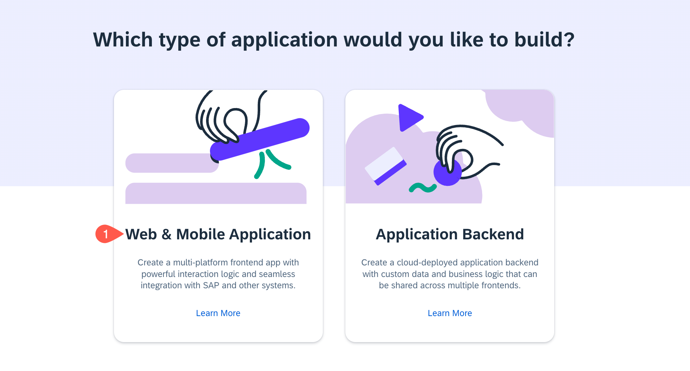
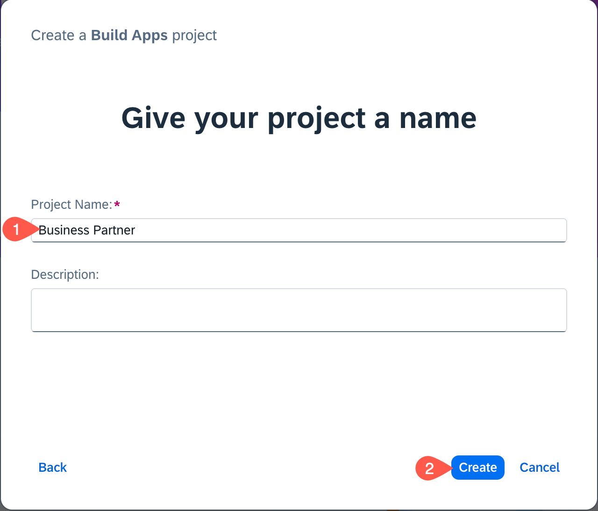
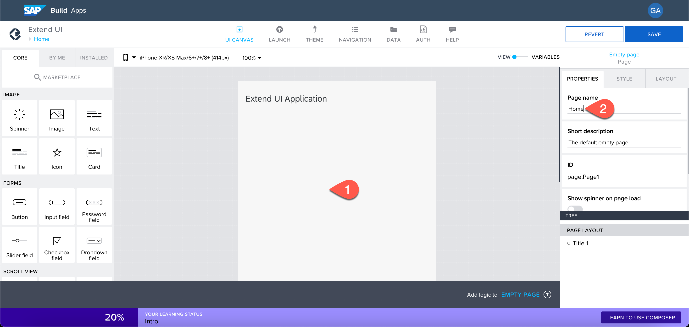
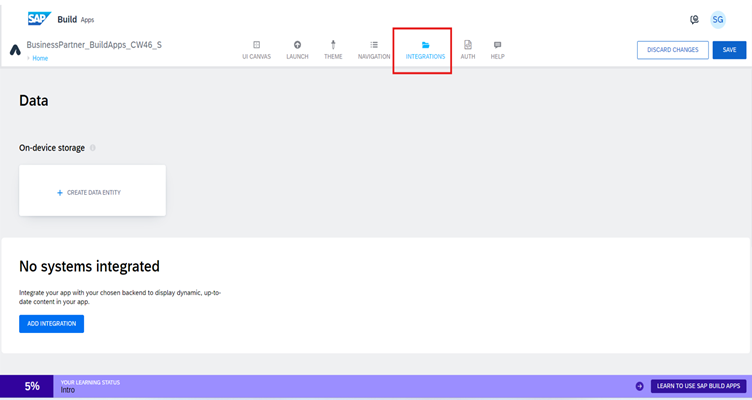
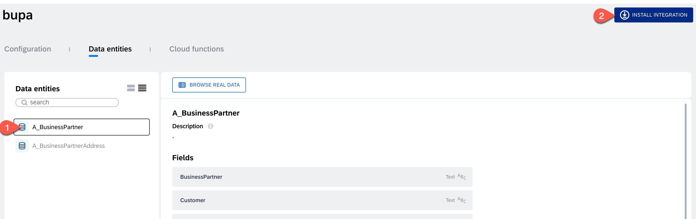

# Create a No-Code Application with SAP Build Apps

In this section, you will create an SAP Build Apps application.

**Persona:** Citizen Developer

**Abbreviation:** SAP Business Technology Platform = SAP BTP

## Open SAP Build Apps

Open **SAP Build Apps Application Development** link if you have it already bookmarked, otherwise open it via the **SAP BTP Cockpit** as described below.

 1. To open **SAP Build Apps Application Development** via SAP cockpit, navigate to your SAP BTP subaccount.
 2. From the left-side of your subaccount menu, navigate from **Services** &rarr; **Instances and Subscriptions**.

 3. In the tab **Subscriptions**, find **SAP Build Apps** and choose **Go to Application** to open the entry page for Application Development.

     

 4. You might be prompted with a log in screen of either default Identity Provider or custom Identity Provider depending on what you have configured.

 5. Log in to the Application using your custom Identity Provider credentials.

## Create an Application Using SAP Build Apps

### Create a Project

1. On the Build, app dashboard choose **Create** 

   

2. Choose **Build an Application** to create a new business application.

   

3. Select **SAP Build Apps**

    
   
5. Choose **Web & Mobile Application**.
   
   

6. Enter a **Project Name**, for example **Business Partner**

7. Enter a **Short Description**.

8. Choose **Create**.

   

9. Your created project will be opened in **App Builder** which is the central page to build your application including a user interface, logic, as well as data integration.

10. Choose **Headline**.

11. Find the **Properties** tab in the menu on the right to change the content of the title. Choose **Content** and change the content from **Headline** to **Extend UI Application**.

   

11. Find the text field in the UI canvas in the center of your screen and choose **x** to remove this component.

   

12. Choose the blank page. On the right side under the **Properties**, choose **Page name**.

13. Change the page name to **Home**.

    

### Enable Authentication

To consume data from your SAP backend system or mock data that is configured as a SAP BTP destination in the previous section, you need to enable authentication.

1. Choose **AUTH** at the top section of the app builder.

2. Choose **Enable Authentication**.

   

3. Select **SAP BTP Authentication** and choose **OK**. This enables authentication for the project.

   

### Add a Data Source

To add a data source, you need to add the following steps to your project.

1. Choose the tab **Data** at the top of App builder.

2. Find section **No systems integrated** and choose **Add Integration**.

   

3. On the next screen **SAP Systems**, select **BTP Destinations**.

4. Select the destination that you have created in the previous section from the list.

5. Under the **Data entities**, select **Search** and enter **A_BUSINESSPARTNER**.

6. Choose **Install Integration**.

   

7. After installing integration, you'll see **Enable Data Entity**. Select **Enable Data Entity** to enable it.

8. Now, search for **A_BusinessPartnerAddress** and choose **Enable Data Entity**.

9. Confirm that both entities have the status _Enabled_

   

10. Choose **Save** at top of the app builder. This adds the data source to your project. Choose **UI Canvas** to go back to the UI designer view.
11. Now you have added a data source for your SAP Build Apps application.
