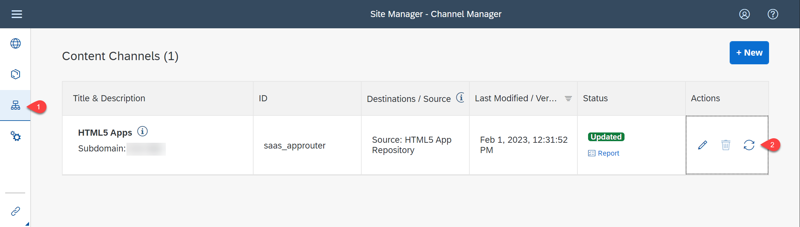
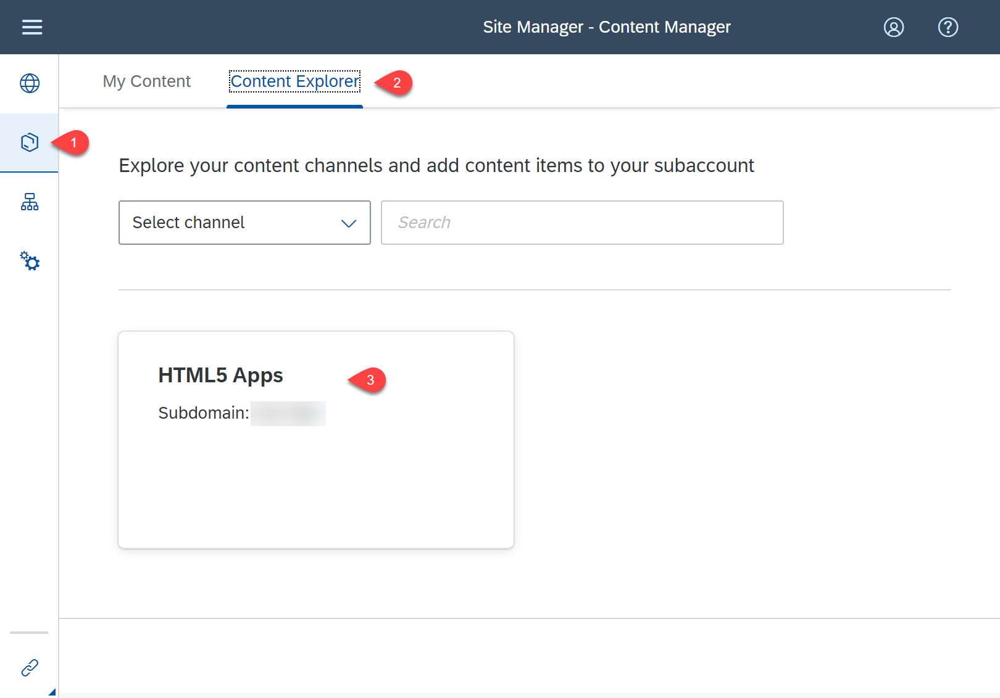
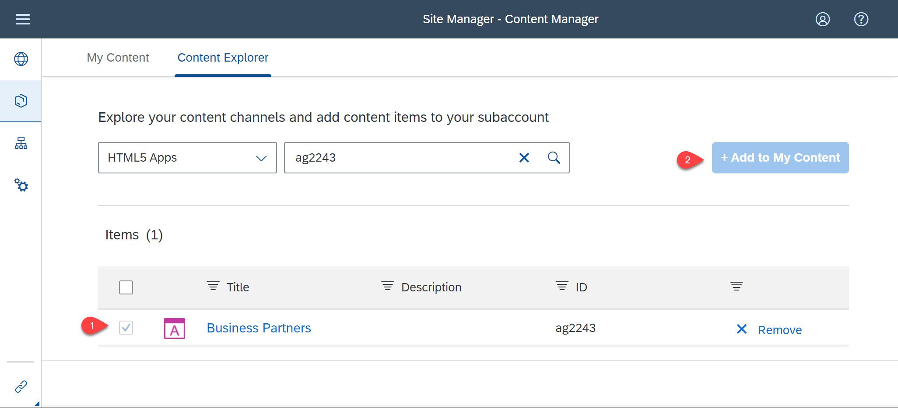
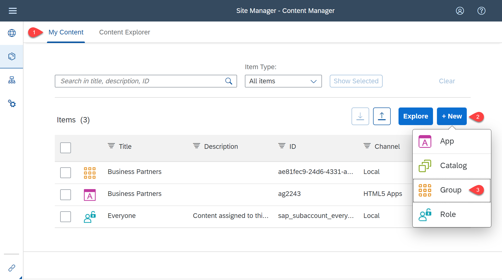
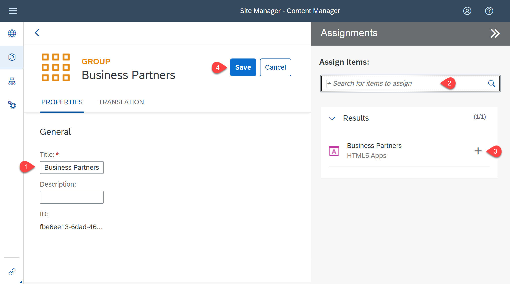
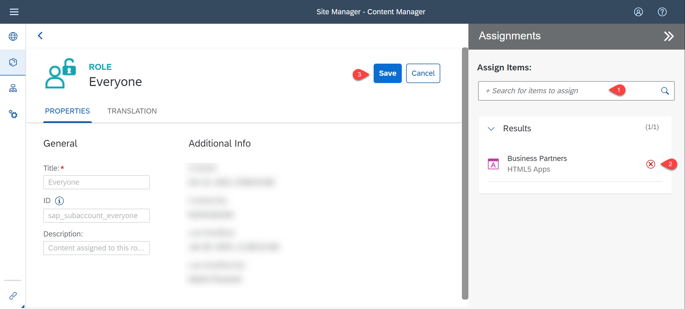
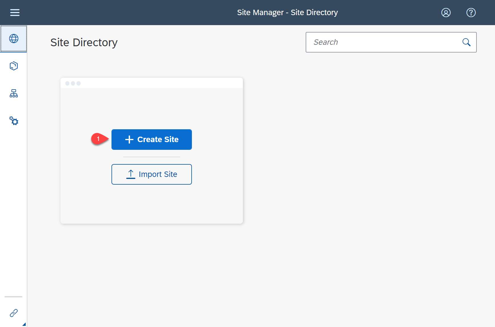
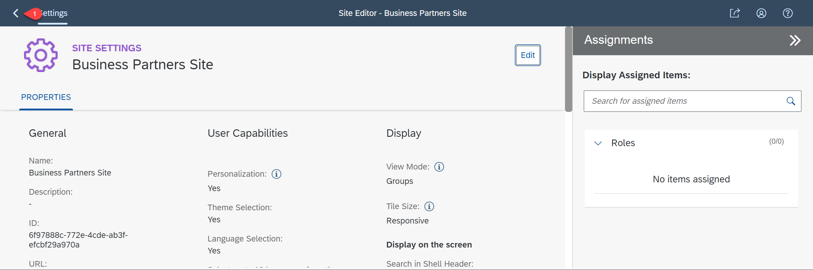
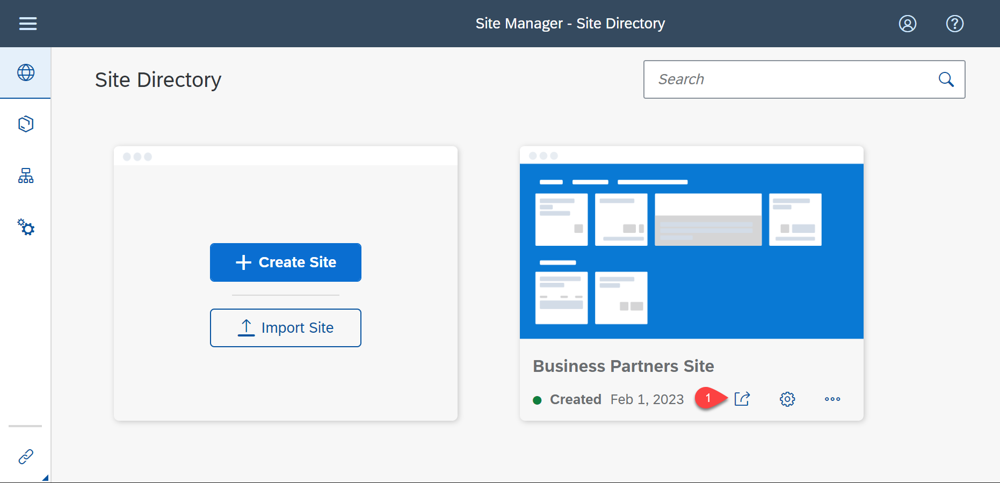
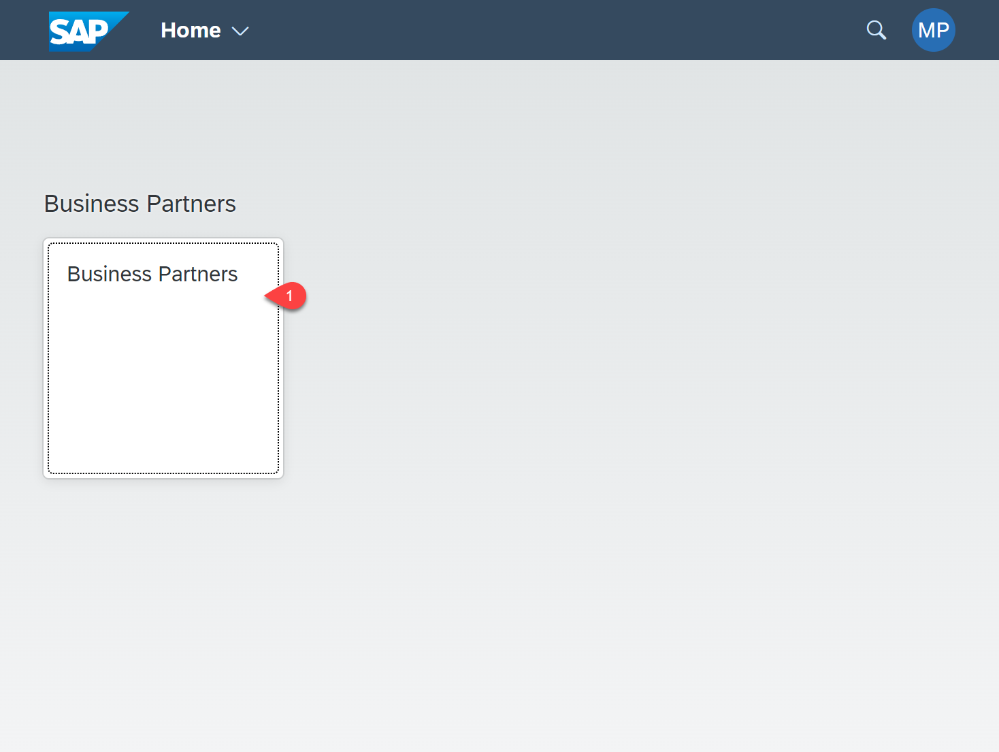

# Integrate the Application with SAP Build Work Zone, standard edition

## Introduction

In this section, the application will be connected with SAP Build Work Zone, standard edition. This allows to have one central entry point to show all of your SAP BTP applications.

###  Integrate with SAP Build Work Zone, standard edition

1. Open your Subaccount and search for **Instances and Subscriptions**.

2. Search for the application **SAP Build Work Zone, standard edition** and choose the icon to open it.

3. In the menu on the left side choose the icon for **Channel Manager**.

4. Choose the refresh icon to fetch the updated content.

    

5. Choose **Content Manager** in the menu on the left and open tab **Content Explorer**.

6. Select the tile _HTML5 Apps_ with your respective subdomain name.

    

7. In the items table, set checkmark for your application and choose the button **Add to My Content**.

    

8. Go to the **My Content** tab, choose **New** and select **Group** from dropdown.

    

9. Add a title.

10. Assign items on the right section of your screen. Search for your application and choose the '+' icon to assign the apps.

11. Choose **Save**.

    

12. Back in the **Content Manager**, choose role **Everyone** and **Edit**.

13. Assign items on the right section of your screen. Search for your application and choose the '+' icon to assign the apps.

14. Choose **Save**.

    

15. In the menu on the left side navigate to **Site Directory**.

16. Choose button **Create Site**.

    

17. Enter the name for the site and choose **Create**.

18. Now, you are forwarded to the site editor.

    

19. Navigate to **Site Directory**.

    

20. Find your created site and open it by choosing **Go to site**.

    

21. Test the application by clicking on the tile.

    

 ## Summary

 Congratulations! You now have finished the development of your application. In this last step you have integrated SAP Build Work Zone, standard edition service, to have one central entry point to show all of your SAP BTP applications.
