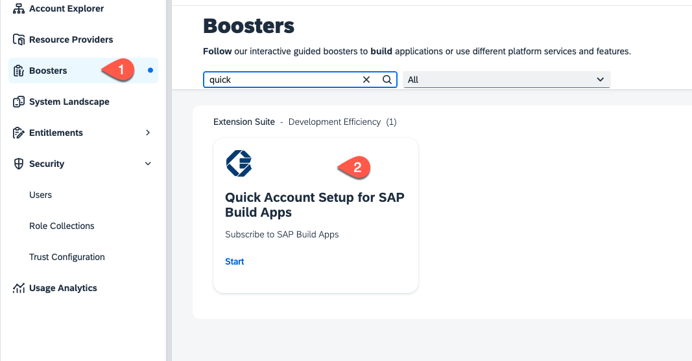
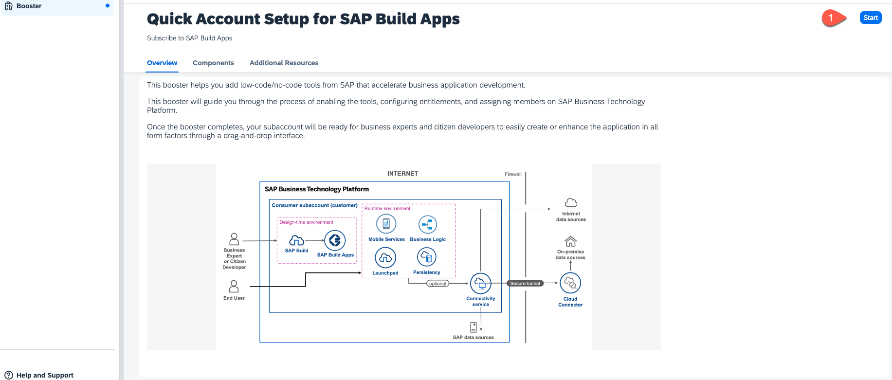

# Get Started with SAP Build Apps - Quick Account Setup

If you have already set up your SAP BTP account for SAP Build Apps by using the one-click deployment link the mission overview or in the tile you can skip this tutorial.

If not use the following steps to set up your account:

## Quick Setup
In this section you will use a booster to setup the landscape for using **SAP Build Apps**. To do this you must be **administrator** of your global SAP BTP account. The process described here will create a new subaccount but you can use the booster to configure an existing subaccount.

1. Logon to the **SAP BTP Cockpit** and select your global account.
2. Select **Boosters** and search for **Quick Account Setup for SAP Build Apps**

   

3. In the overview page press **Start**
   
   

4. The prerequisites will be checked. By choosing the pencil icon you can change the naming of the subaccount and the plan of the service entitlements. If you are fine with those settings choose **Setup my Account**. If you like to use an existing subaccount or need to add additional users select **Switch to Detailed Setup** - [see next section](./QUICKSETUP.md#detailed-setup)
   
   

5. The setup will take some minutes

   

6. When the setup was succesful you can **Open SAP Build Apps**
   
   

7. The SAP Build lobby appears
   
   

## Detailed Setup

1. When the prerequisites are checked successfully, press **Next**.

    

2. Select **Create Subaccount** or choose **Select Subaccount** if you want to install in an existing one and press **Next**.

    

3 Set **SAP Build Apps** and **SAP Build Workzone, standard edition**. For testing purpose you can choose the **free** service plan, for productive usage take the **standard** plan.

   

4. In the section **Custom Identity Provider for Applications**, select the tenant you want to use. You can add additional administrator and developer user, then press **Next**.

    

5.  Check your settings and press **Finish**

6. Choose **Navigate to subaccount**, which will open the subaccount on another tab. Come back to this tab and press **Close**.

