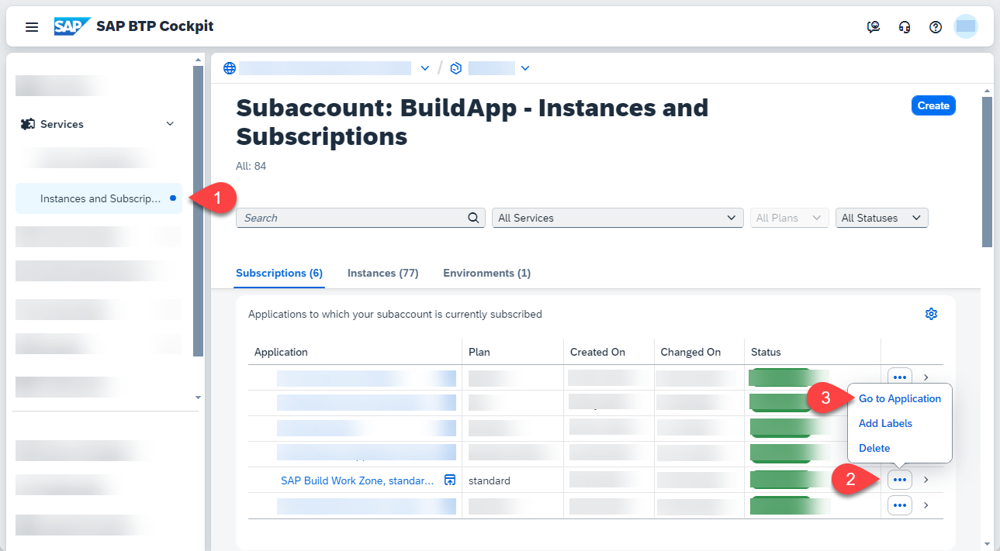
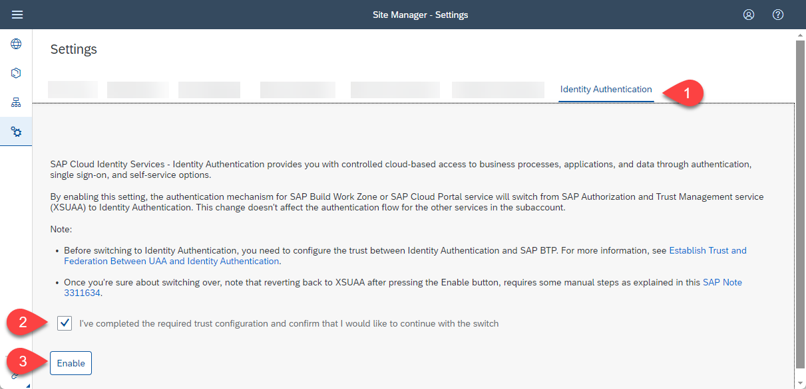
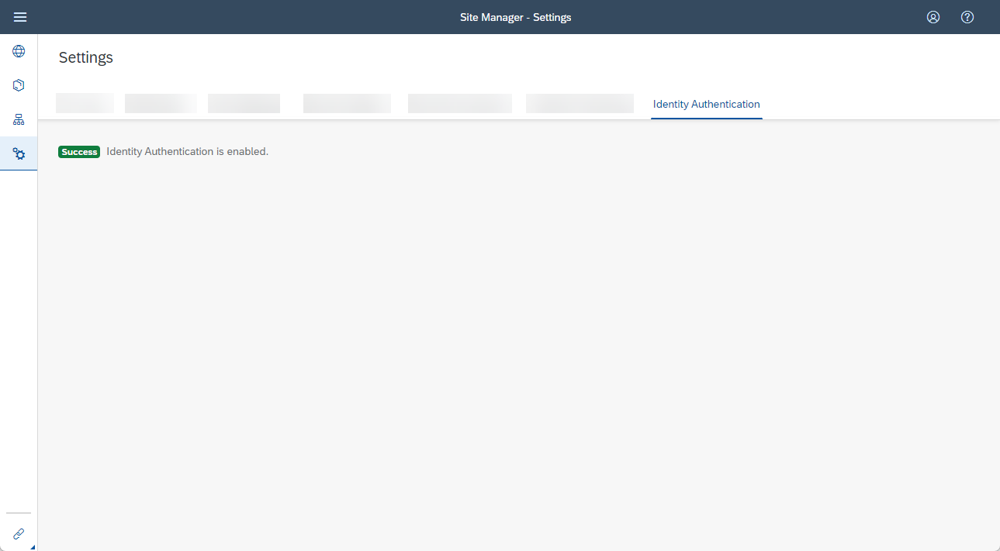
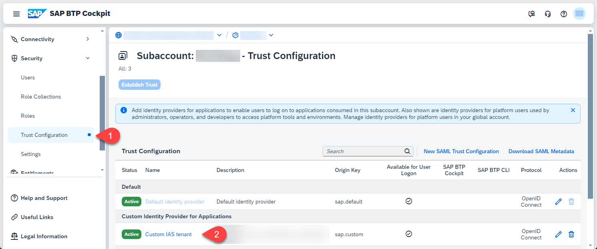
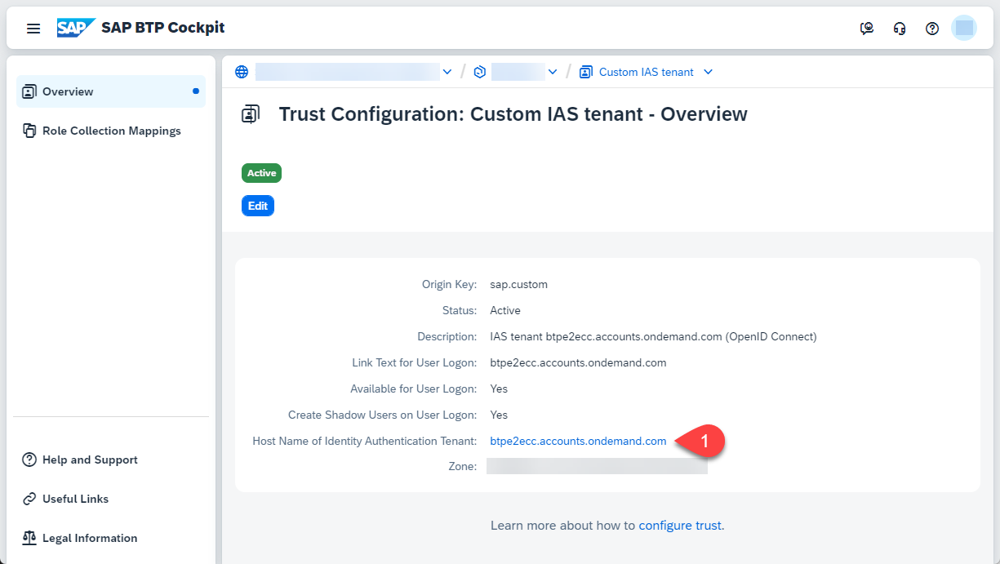

# Get Started with SAP Build Apps - Quick Account Setup

If you have already set up your SAP BTP account for SAP Build Apps by using the _Get Started with SAP Build Apps - Quick Account Setup_ link the mission overview or in the previous tile, you can skip this tutorial.

Otherwise, use the following steps to set up your account. As an alternative you could also use the provided [Terraform script](https://github.com/SAP-samples/btp-terraform-samples/blob/main/released/discovery_center/mission_4024/README.md).

## Quick Setup
In this section you will use a booster to (create and) set up a subaccount for using **SAP Build Apps**. To do this, you must be **administrator** of your global account on SAP BTP. You can start the booster by selecting the booster icon at this tile.
  
  > You can also start the booster from the SAP BTP Cockpit:
  > * Logon to the **SAP BTP Cockpit** and select your global account.
  > * Select **Boosters** and search for **Get Started with SAP Build Apps - Quick Account Setup**    
  > * In the overview page press **Start**
 
1. After starting the booster choose the Identity Provider you are using for the user authentication of your global SAP BTP account. If you are using  a **Custom IAS Tenant** you have to set the URL for the tenant. Then press **Launch**
   

2. If you have access to mulitple global accounts select the one that you like to use for this installation.

      

3. The prerequisites will be checked. By choosing the pencil icon you can change the naming of the subaccount and the plan of the service entitlements. If you are fine with those settings choose **Setup my Account**. If you like to use an existing subaccount or need to add additional users select **Switch to Detailed Setup** - [see next section](./QUICKSETUP.md#detailed-setup)
   
   

4. The setup will take a couple of minutes.

   

5. Upon successful setup, you can **Open SAP Build Apps**.
   
   

6. The SAP Build lobby appears.
   
   

After the Setup, you need to enable the **Identity Authentication for SAP Build Work Zone** - [see here](./QUICKSETUP.md#enable-the-identity-authentication-for-sap-build-work-zone)

## Detailed Setup

1. When the prerequisites are checked successfully, press **Next**.

    

2. Select **Create Subaccount** or choose **Select Subaccount** if you want to set up an existing subaccount and press **Next**.

    

3. Set **SAP Build Apps** and **SAP Build Workzone, standard edition**. For testing purpose you can choose the **free** service plan, for productive usage take the **standard** plan.

   

4. In the section **Custom Identity Provider for Applications**, select the tenant you want to use. Optionally, add additional administrator and developer users, then press **Next**.

    

5.  Check your settings and press **Finish**.

6. Choose **Navigate to subaccount**, which will open the subaccount on another tab. Come back to this tab and press **Close**.

In the next step you have to enable the **Identity Authentication for SAP Build Work Zone**.

## Enable the Identity Authentication for SAP Build Work Zone

By default **SAP Build Work Zone, advanced edition** uses the SAP Authentication and Trust Management service (XSUAA) for identity authentication. 
This section contains the steps that you have to fulfill  to switch to SAP Cloud Identity Services - Identity Authentication as the authentication mechanism.

**Note:** This is a one-time setup which impact all SAP Build Work Zone assets that are used in the same subaccount.
**But** the steps needs to be made for each SAP BTP subaccount where SAP Build Apps applications are being deployed.

1. Select **Instances and Subcriptions**. Click on the **...** of the **SAP Build Work Zone, standard Edition** and press **Go to Application**. 

   
2. This will open the Site Manager. Click on the Settings on the side panel.

   
3. Choose the **Identity Authentication** tab. Then **confirm** that your subaccount has an active trust configuration with SAP Cloud Identity Services - Identity Authentication. Press **Enable**.

   
4. The switch can take up to 15 minutes to take effect. 
When the switch is done, you will see a success message.

   

Further information you can find in SAP Help Portal: [Post Booster Configuration](https://help.sap.com/docs/build-work-zone-advanced-edition/sap-build-work-zone-advanced-edition/post-booster-configuration)

## Connect SAP Build Workzone with your SAP Build App Service

1. To open your Cloud Identity Services choose **Trust Configuration** and click on your **Custom IAS tenant**.

   
2. Click on your **Identity Authentication Tenant**

   
3. This will open your Cloud Identity Services Site. Click on **Applications & Resources** and choose **Applications**.

   
4. Choose  **SAP Build Workzone, standard edition** on the left pane and then **Dependencies**

   
5. Click **Add** to add a new Dependency.

   
6. Enter **sap-build-apps-api** for the Dependency Name. 
**Important:** the name is case sensitive. At the end click **Save**.

   

   

Further information you can find in the SAP Help Portal: [Deployed Applications](https://help.sap.com/docs/build-apps/service-guide/integration-to-app-builder?q=workzone#deployed-applications)

