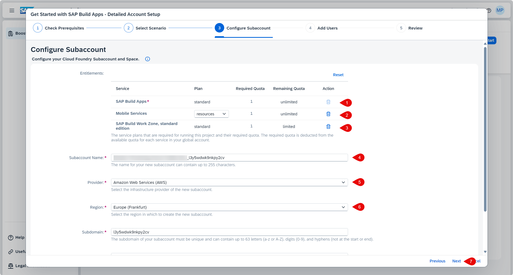

# Get Started with SAP Build Apps - Quick Account Setup

If you have already set up your SAP BTP account for SAP Build Apps by using the _Get Started with SAP Build Apps - Quick Account Setup_ link the mission overview or in the previous tile, you can skip this tutorial.

Otherwise, use the following steps to set up your account:

## Quick Setup
In this section you will use a booster to (create and) set up a subaccount for using **SAP Build Apps**. To do this, you must be **administrator** of your global account on SAP BTP. You can start the booster by selecting the booster icon at this tile.
  
  > You can also start the booster from the SAP BTP Cockpit:
  > * Logon to the **SAP BTP Cockpit** and select your global account.
  > * Select **Boosters** and search for **Get Started with SAP Build Apps - Quick Account Setup**    
  > * In the overview page press **Start**
 
1. After starting the booster choose the Identity Provider you are using for the user authentication of your global SAP BTP account. If you are using  a **Custom IAS Tenant** you have to set the URL for the tenant. Then press **Launch**
   

2. If you have access to mulitple global accounts select the one that you like to use for this installation.

      

3. The prerequisites will be checked. By choosing the pencil icon you can change the naming of the subaccount and the plan of the service entitlements. If you are fine with those settings choose **Setup my Account**. If you like to use an existing subaccount or need to add additional users select **Switch to Detailed Setup** - [see next section](./QUICKSETUP.md#detailed-setup)
   
   

4. The setup will take a couple of minutes.

   

5. Upon successful setup, you can **Open SAP Build Apps**.
   
   

6. The SAP Build lobby appears.
   
   

## Detailed Setup

1. When the prerequisites are checked successfully, press **Next**.

    

2. Select **Create Subaccount** or choose **Select Subaccount** if you want to set up an existing subaccount and press **Next**.

    

3. Set **SAP Build Apps** and **SAP Build Workzone, standard edition**. For testing purpose you can choose the **free** service plan, for productive usage take the **standard** plan.

   

4. In the section **Custom Identity Provider for Applications**, select the tenant you want to use. Optionally, add additional administrator and developer users, then press **Next**.

    

5.  Check your settings and press **Finish**.

6. Choose **Navigate to subaccount**, which will open the subaccount on another tab. Come back to this tab and press **Close**.

