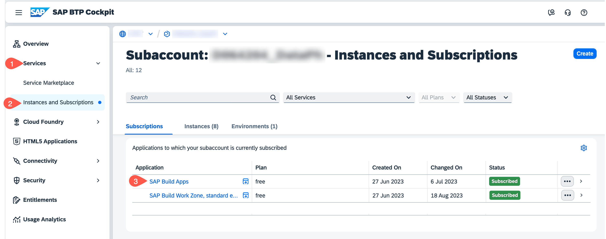

# Start with SAP Build Apps

**Persona:** Citizen Developer

## Open SAP Build Apps

Open the **SAP Build Apps Application Development** link if you have it already bookmarked, otherwise open it via the **SAP BTP Cockpit** as described below.

 1. To open **SAP Build Apps Application Development** via SAP cockpit, navigate to your SAP BTP subaccount.
 2. From the left-side of your subaccount menu, navigate from **Services** &rarr; **Instances and Subscriptions**.

 3. In the tab **Subscriptions**, find **SAP Build Apps** and choose **Go to Application** to open the entry page for Application Development.

     

 4. You might be prompted with a log in screen of either default Identity Provider or custom Identity Provider depending on what you have configured.

 5. Log in to the Application using your custom Identity Provider credentials.

## Implement a simple Application
To get an introduction to SAP Build Apps you can take a look to the first part of this starter tutorial: [Create an Application with SAP Build Apps](https://developers.sap.com/tutorials/appgyver-create-application.html)

## 
