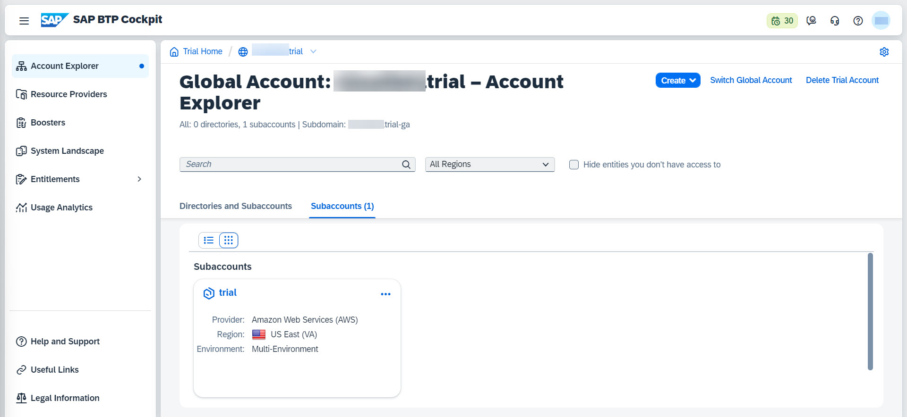
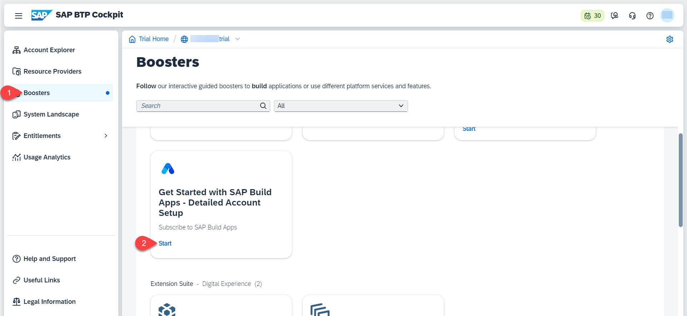
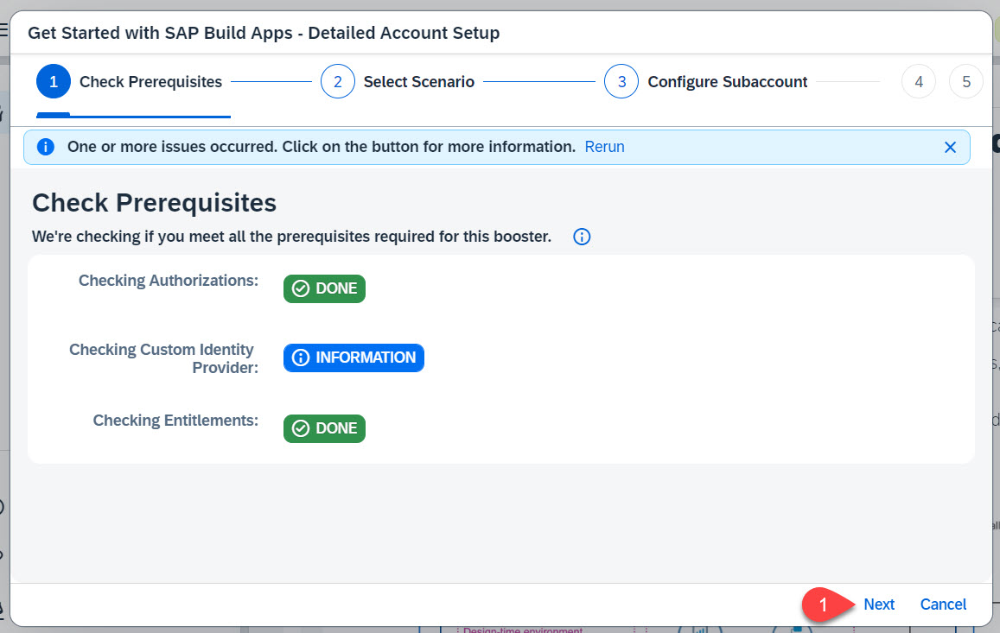
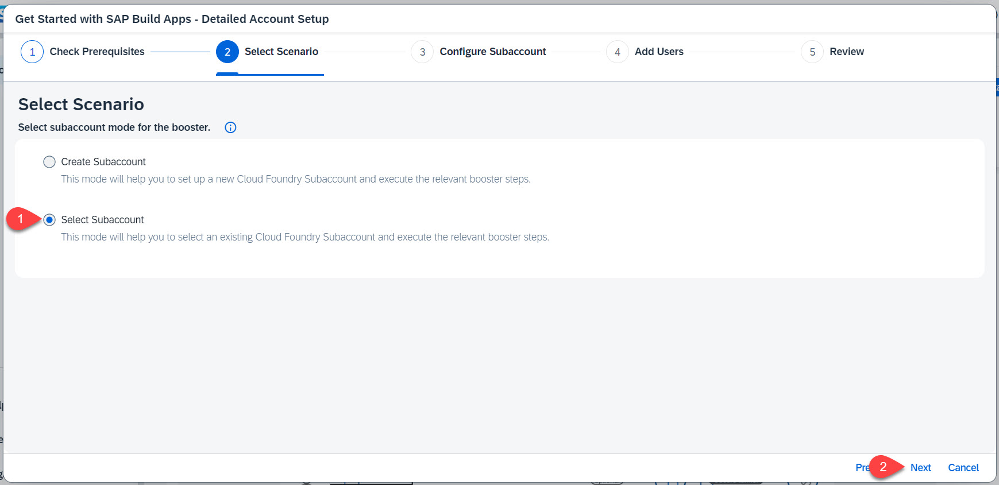
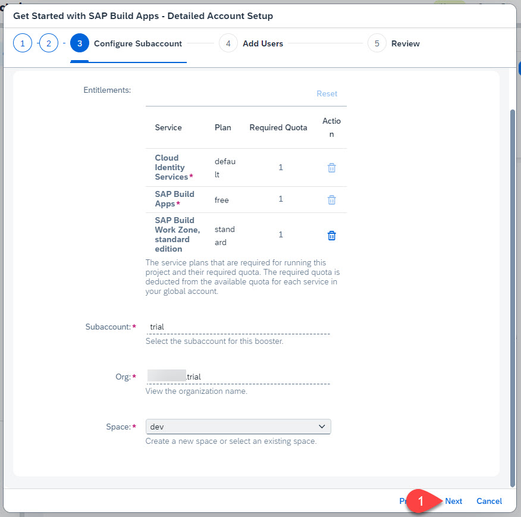
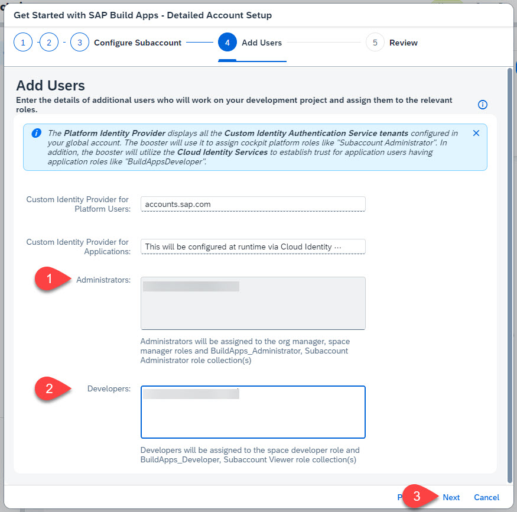
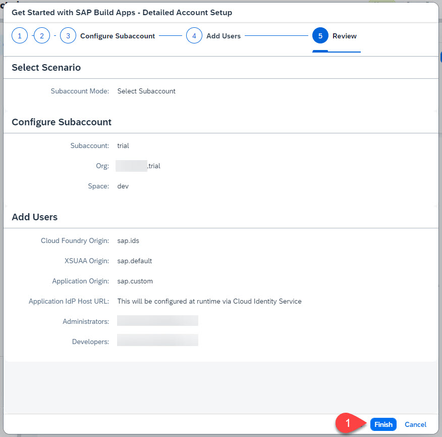
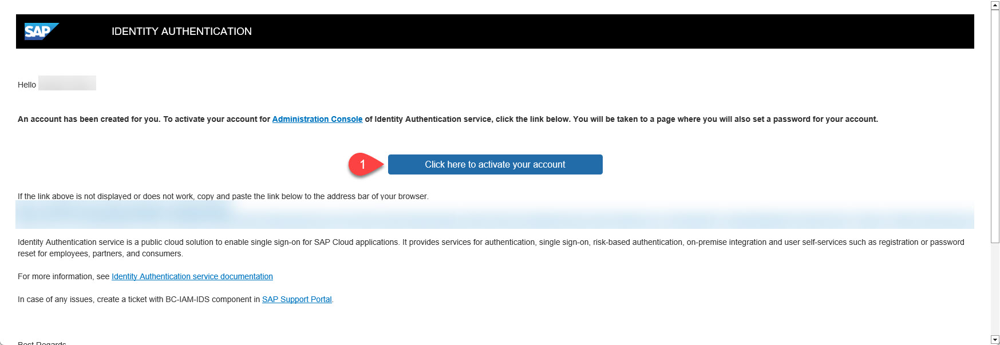
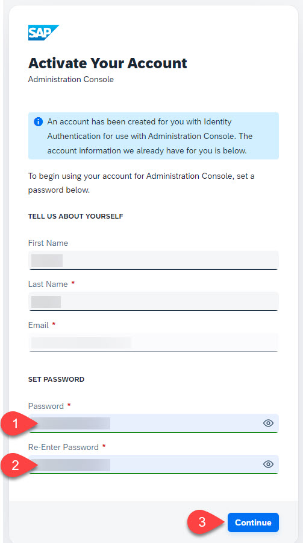
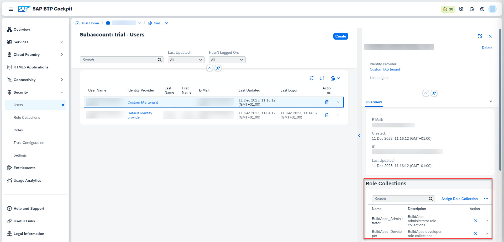

# Setup the SAP Build Apps Service
In this section you will use a booster to setup the landscape in your **SAP BTP Trial Account** for using **SAP Build Apps**. The process described here will use the already existing subaccount, because of the limitations in the Trial Account.

**Important:** Currently, you cannot deploy applications with SAP Build Workzone on your trial landscape! 

Logon to your trial account

## Run the Booster (Detailed Account Setup)
Select **Boosters**. Search for SAP Build Apps. Press **Start**.

When the prerequisites are checked successfully, press **Next**.

> Hint: If you there is an error, please try to rerun the booster again

Choose **Select Subaccount** and press **Next**.

Find the configuration of your account and adjust the remaining fields if necessary and then press **Next**.

In the section **Custom Identity Provider for Applications**, select the tenant you want to use, provide your **email**, then press **Next**.

Check your settings and press **Finish**.

Choose **Navigate to subaccount**, which will open the subaccount on another tab. Come back to this tab and press **Close**.
Go to your email inbox and find the activation mail for your IAS account. Choose **Click here to activate your account**.

This will open a new webpage where you can configure your IAS Profile. Set a password, which you can use to access SAP Build Apps. Choose **Continue**.

## Result
The subaccount has been configured with a custom IAS tenant and your user has been assigned the relevant role collections.

In the next step you will learn how to Open the SAP Build Apps via the SAP BTP Cockpit.

