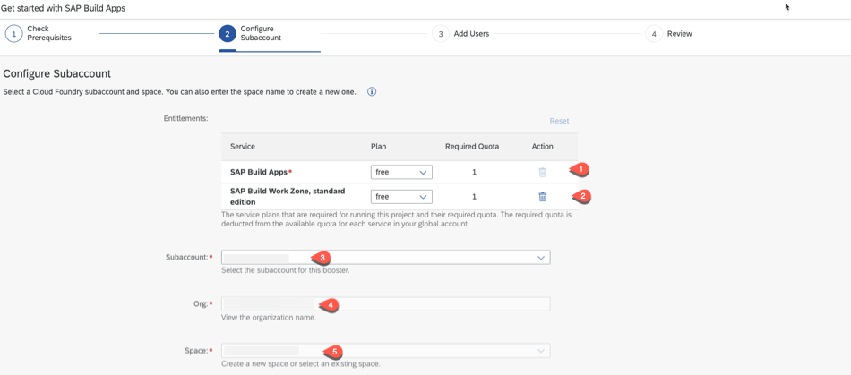
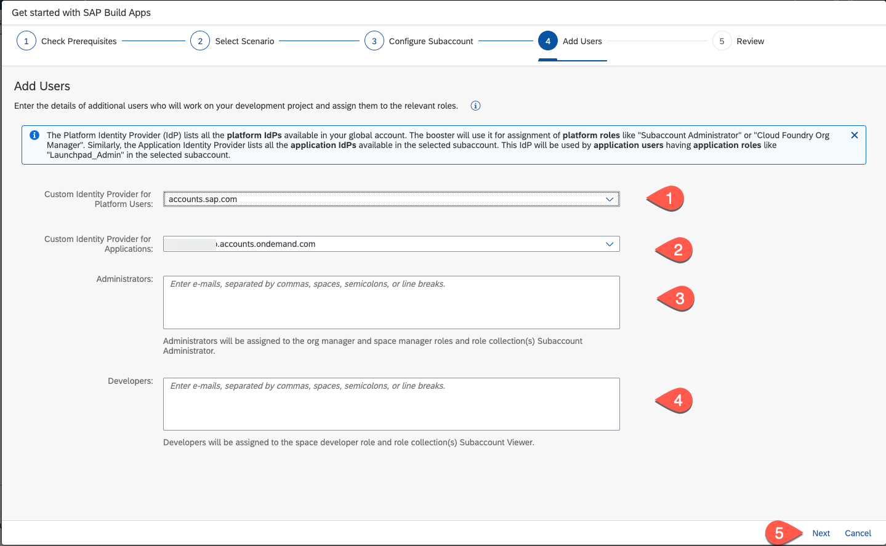

# Setup the SAP Build Apps Service

In this section you will setup the landscape for using **SAP Build Apps**. To do this you must be **administrator** of your global SAP BTP account.

## Create a new Subaccount

Logon to the **SAP BTP Cockpit** and select your global account.
Select **Create** and choose **Subaccount**

In the **Create Subaccount** page set a **Display Name** and the **Subdomain ID**.
Select a region where **SAP Build Apps** is available. You find the overview in the [Service Catalog of SAP Discovery Center](https://discovery-center.cloud.sap/serviceCatalog/sap-build-apps?region=europe(frankfurt)&tab=service_plan)

Choose the created subaccount. In the Overview page choose **Enable Cloud Foundry** 

## Add your Identity Autentication Service

> **Prerequisite:** You have created an [IAS Tenant](https://help.sap.com/docs/BUILD_APPS/431746e4c663458aa68d9754b237bfc6/01225b6b951d425c97b58a834a1ff484.html?locale=en-US#prerequisite%3A-ias-tenant)

In the SAP BTP Cockpit of your subaccount open the **Security** section. Choose **Trust Configuration** and press **Establish Trust**

Choose your Custom Identity Provider tenant and choose **Establish Trust**

## Run the Booster

At the SAP BTP Cockpit select your global account. Select **Boosters** and search for SAP Build Apps. Press **Start**

In **Get started with SAP Build Apps** press **Start**

If the prerequisites are checked. press **Next**

**Select Subaccount** and press **Next**

For testing purpose you can choose the **free** service plan, for productive usage take the **standard** plan. Choose your **subaccount** and **space**. Press **Next**.

In the section **Custom Identity Provider for Applications** select the Identity Authentication tenant you have setup in the previsious section.
Add the email for all adminstrators and developer members. Press **Next**.

Check your settings and press **Finish**

## Map Roles

Follow the steps in [SAP Help](https://help.sap.com/docs/BUILD_APPS/431746e4c663458aa68d9754b237bfc6/01225b6b951d425c97b58a834a1ff484.html?locale=en-US#configuring-user-roles)

## Links 
* [SAP Help: Subscribe to SAP Build Apps](https://help.sap.com/docs/BUILD_APPS/431746e4c663458aa68d9754b237bfc6/01225b6b951d425c97b58a834a1ff484.html?locale=en-US)