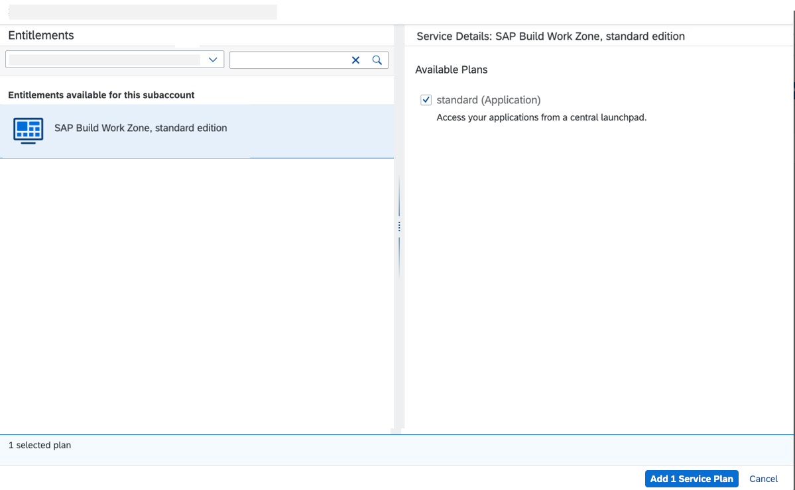
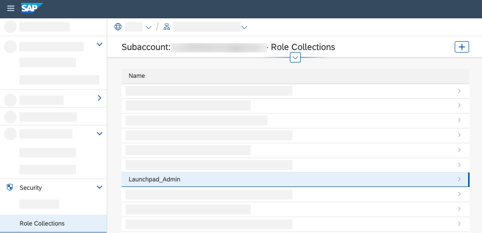
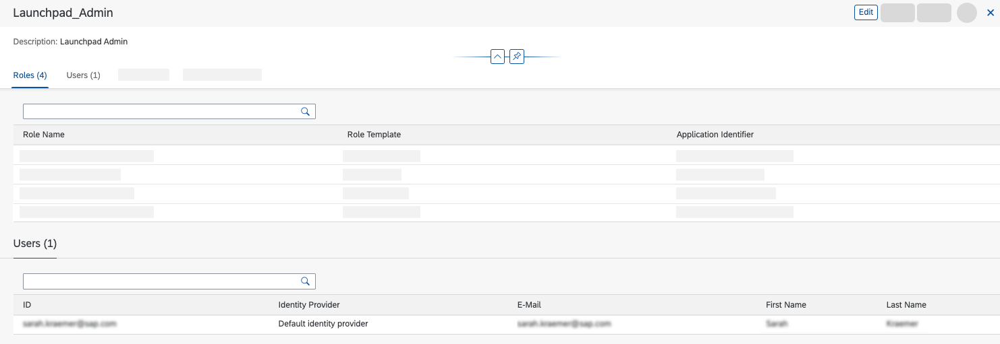

# Subscribe to SAP Launchpad Service
## Introduction

In this section, you will learn how to subscribe to SAP Launchpad Service and configure user roles. You need this subscription to run the SAP AppGyver application as HTML5 Application with Managed Application Router provided by SAP Launchpad Service on SAP BTP.

**Persona:** SAP BTP Developer

## Step-by-Step

1. After your account was created, open your created **Subaccount**

2. From the left-side subaccount menu navigate to **Entitlements** &rarr; **Configure Entitlements** &rarr; **Add Service Plans** to add more services to your account.

    

3. In the pop-up use, the search function to find required entitlements and then choose the **Launchpad Service** plan on the left site.

4. Choose **Add 1 Service Plan**.

    

5. Choose **Save** to finish the configuration.

    

6. In the menu on the left, choose **Service Marketplace** and search for **Launchpad Service**.

7. Choose **Launchpad Service** tile.

    

8. In the menu appeared on the right side of your screen, choose **Create** and confirm creation in the pop-up screen.

    

9. In the menu on the left, navigate to **Security** &rarr; **Role Collections**.

     

10. In the role collection list, find _Launchpad Admin_ and choose it to open.

11. Choose the **Edit** button and scroll down to **User** section. Enter your e-mail address in the section and select _Default Identity Provider_ as **Identity Provider**.

12. Choose **Save**.

    
