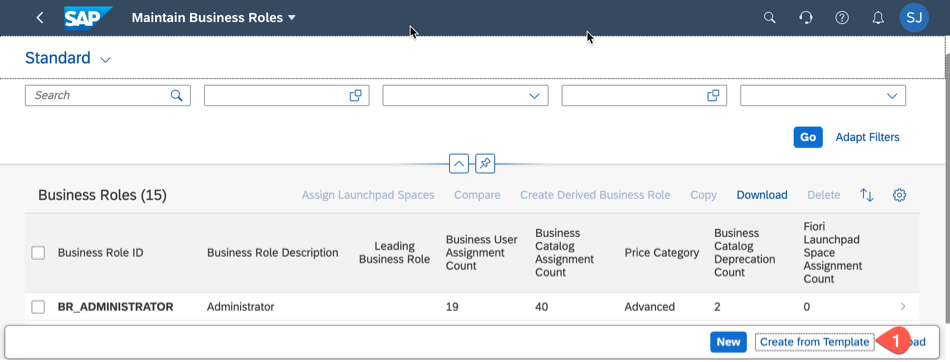
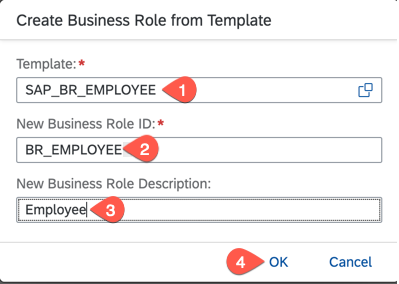
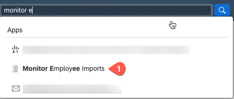
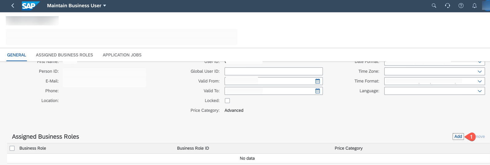
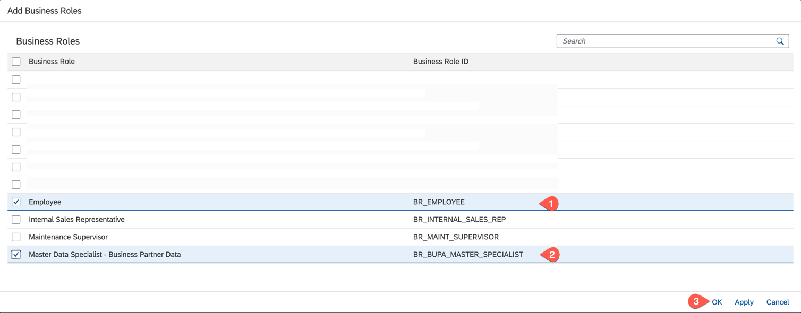
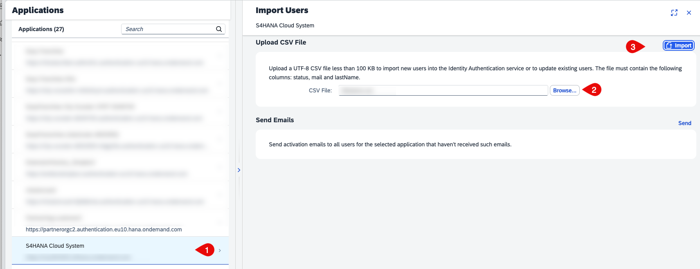
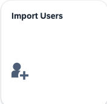

# Create Business Users and Business Roles in the SAP S/4HANA Cloud System

In SAP S/4HANA Cloud, applications and systems can be accessed by business users or technical users. Authorizations for business users are based on business roles. Authorizations for technical users are based on communication scenarios.

See section [Set Up Your SAP S/4HANA Cloud](https://help.sap.com/docs/SAP_S4HANA_CLOUD/b249d650b15e4b3d9fc2077ee921abd0/a231ac4439e24935b0447bc49e75995c.html) on SAP Help Portal for more details.

In this documentation, we refer to the sub-steps, which are needed to run the sample application. See section [Authorization and User Concept in SAP S/4HANA Cloud](https://help.sap.com/docs/SAP_S4HANA_CLOUD/b249d650b15e4b3d9fc2077ee921abd0/bbae7c15953443fea0b5b0211488e919.html) on SAP Help Portal for more details.

## [Optional] Initial Setup for SAP S/4HANA Cloud

SAP S/4HANA Cloud system provides a large number of features to support your company's business processes.
If you have already have an administrator user for the SAP S/4HANA Cloud system, you can skip this step. See section [User Onboarding for SAP S/4HANA Cloud](https://help.sap.com/docs/SAP_S4HANA_CLOUD/b249d650b15e4b3d9fc2077ee921abd0/30415f166409468689b31571989e4b95.html) on SAP Help Portal if you have created initial users for your SAP S/4HANA Cloud system. Follow the official documentation, to do the initial setup for your Starter, Quality, and Productive systems.

### [Optional] Create the Administrator Business User and Role

If you already have an administrator user with an administrator role for the SAP S/4HANA Cloud system, you can skip this step. Otherwise, follow the official documentation to [Create an Administrator Business User](https://help.sap.com/docs/SAP_S4HANA_CLOUD/b249d650b15e4b3d9fc2077ee921abd0/f5064daae98044809f29046df1b8c0da.html) and [Create the business role for an Administrator](https://help.sap.com/docs/SAP_S4HANA_CLOUD/55a7cb346519450cb9e6d21c1ecd6ec1/8fa28e0107984d42a99b9eea67856cea.html?version=2208.500). Also make sure that the Administrator user is imported in the SAP Cloud Identity Service - Identity Authentication. See section [Self-Activation of Business Users in the Identity Authentication Service](https://help.sap.com/docs/SAP_S4HANA_CLOUD/b249d650b15e4b3d9fc2077ee921abd0/7471582739dc4bb38a291859d82f7d47.html) for more details.

### [Optional] Create the Employee Business Role

In this section, you will create a business role for employees. You can skip this step if you already have an employee business role in your SAP S/4HANA system.

1. Access your SAP S/4HANA Cloud system with your new administrator business user. Use the URL, which you have received from the SAP Cloud Identity Service - Identity Authentication in the format `https:\\<mys4hc>.s4hana.ondemand.com`.

2. Access the **Maintain Business Roles** application and create the employee business role by choosing **Create from Template**.

   

3. Choose the **SAP\_BR\_EMPLOYEE** template, enter **New Business Role ID**, and choose **OK**.

   

### Create the Business Role to Access Business Partner Application

You can skip this step, if your SAP S/4HANA system already has a business role to access the **Maintain Business Partner** application.

1. In your SAP S/4HANA system, access the **Maintain Business Roles** application and choose **Create from Template**.

2. Choose the **SAP\_BR\_BUPA_MASTER\_SPECIALIST** template, enter a **New Business Role ID**, and choose **OK** to create the role, which has to be assigned to your business users to access the Business Partners application.

### [Optional] Create Employees and Business Users

In this section, you will import and create basic business users to run the sample application. If you already have a business user, you can skip this step. See section [Import Employees](https://help.sap.com/docs/SAP_S4HANA_CLOUD/0bebd08dffca45afa67b1f751199afd0/1b32df57f8c2073ee10000000a4450e5.html) for more details.

1. In your SAP S/4HANA Cloud system, choose the **Import Employees** tile.

   

2. You will get a message that the download is complete. Choose **OK** to close the popup.

   

3. Open the downloaded CSV template and check the sample values provided.

4. Fill the mandatory columns for all the employees to be imported. Fill the **EmailAddress** field for all the employees as we need the e-mail address for activation of user in the SAP Cloud Identity Service - Identity Authentication.

5. Delete the default sample employee data and save the changes.

6. In the **Import Employees** application:
   - Check **Import Type** and select **Basic Employee Import**.
   - Select the same **Delimiter** format as the CSV file, which you have downloaded earlier.
   - In **Import Data**, choose **Browse** and select the file and choose **Open**.
   - Enter a meaningful **Import Name** and choose **Import**.

   

7. Choose **OK** in the popup, which opens up the **Monitor Employee Imports** application.

   

8. Alternatively, you can enter **Monitor Employee Imports** in the search field to open the application, to check if the import of the employees was successful.

   

## Maintain Business User and Business Roles in the SAP S/4HANA Cloud System

1. In your SAP S/4HANA Cloud system, choose the **Maintain Business Users** tile.

2. Select the imported business user from the previous step.

   

3. In the section **Assigned Business Roles**, choose **Add**.

   

4. Choose the roles **BR\_EMPLOYEE** and **BR\_BUPA\_MASTER\_SPECIALIST** and choose **OK** to give employee role and role to access the **Maintain Business Partner** application and data.

   

5. Choose **Save** to save the changes and repeat the previous steps for all imported employees. You can also create additional business roles from template and assign the business roles as per your need.

   

## Import Business Users in the SAP Cloud Identity Service - Identity Authentication

You now have to import the newly created business users in the SAP Cloud Identity Service - Identity Authentication, which comes along with your SAP S/4HANA Cloud tenant and also send activation mails for the business users. You can skip this step if your business user is already in the SAP Cloud Identity Service - Identity Authentication tenant.

1. In your SAP S/4HANA Cloud system, in the **Maintain Business Users** application, choose **Download** and **Download for IDP** to download the added business users.

   

2. Log on to SAP Cloud Identity Service - Identity Authentication with your administrator user.

3. Access the **Import Users** application and choose the CSV file, which you have downloaded in step 1 and choose **Import** to import the users.

   

   

4. Select **Send E-Mails** and choose **Send** to send activation e-mails to the newly imported users. The business users can now access the SAP S/4HANA system.

## Summary

You have successfully finished the initial setup of your SAP S/4HANA system, created administrator user, business user, and assigned relevant roles for all the business users.
