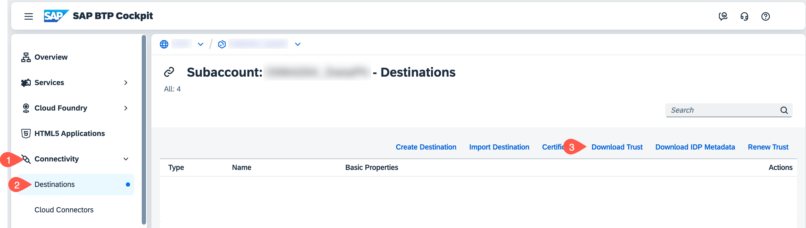
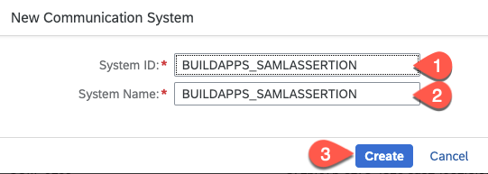
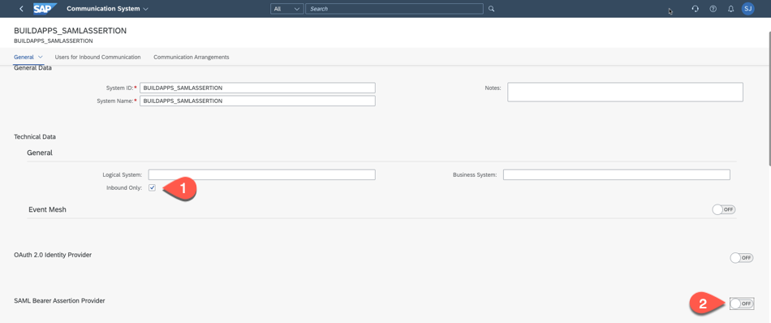
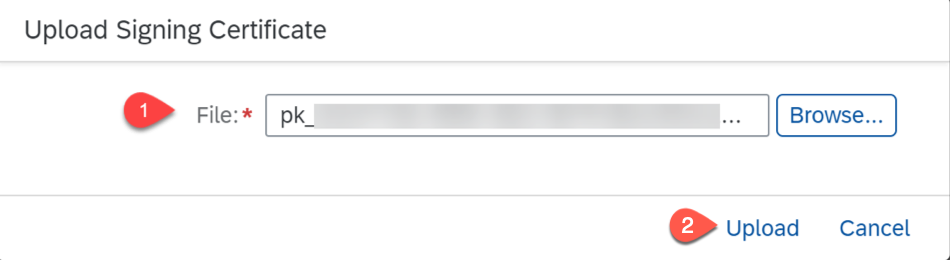
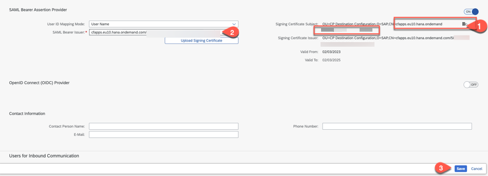

# Configure Communication Settings in SAP S/4HANA Cloud

To allow inbound communication with the SAP S/4HANA tenant, you need to create a communication arrangement. The communication arrangement defines which system (communication system) and which user can call which APIs (communication scenarios).

See section [User Propagation from the Cloud Foundry Environment to SAP S/4HANA Cloud](https://help.sap.com/docs/CP_CONNECTIVITY/cca91383641e40ffbe03bdc78f00f681/9af03a067bf74457ba0de0221b9cc72a.html) on SAP Help Portal for more details.

## Download SAP BTP OAuth Certificate

Download the certificate from your Cloud Foundry subaccount on SAP BTP. You will need this later when configuring the SAP S/4HANA Cloud system.

1. In **SAP BTP Cockpit**, navigate to your subaccount.

2. From the left-side subaccount menu navigate from **Connectivity** &rarr; **Destinations**.

   

3. Choose **Download Trust**.

## Log on to the SAP S/4HANA Cloud System

1. Enter the URL of the SAP S/4HANA Cloud System in your browser, which is of format:

   `https://myXXXXXX.s4hana.ondemand.com/ui#Shell-home`

   Replace the X with your actual tenant hostname.

2. Enter your administrator **E-MAIL**.

3. Enter your administrator **Password**.

## Create Communication User

1. Choose the **Define Communication Users** application tile:

   

2. Choose **New**.

3. Enter the **User Name**. Copy this user name in a text editor of your choice. You will use this later when creating a destination in your SAP BTP subaccount.

4. Enter the **Description**.

5. Choose **Propose Password**.

6. Copy the proposed password in a text editor of your choice. You will use this later when creating a destination in your SAP BTP subaccount.

7. Choose **Create**.

   

8. Go back to **Home**.

## Create Communication System

1. Choose the **Communication Systems** application tile.

   

2. Choose **New**.

3. Enter the **System ID** and a unique value for **System Name**.

   

4. Choose **Create**.

5. Enter the **Hostname**, for example: your SAP BTP subaccount host details: `account.hana.ondemand.com`

6. Enter the **Logical System**, use some 3 digit/letters for example: BTP
It must be unique in your SAP S/4HANA Cloud system.

7. Enter the **Business System**, use some 3 digit/letters for example: BTP
It must be unique in your SAP S/4HANA Cloud system.

8. Set the switch **OAuth 2.0 Identity Provider** from **OFF** to **ON**.

   

9. Choose **Upload Signing Certificate**.

   

10. Copy the complete value of the **CN** property from the **Signing Certificate Issuer** including the unique GUID and paste it in the **OAuth 2.0 SAML Issuer** field.

    

11. Choose **+** in the **Users for Inbound Communication** section.

12. Select the **Communication User** that you created earlier.

    

13. Choose **OK**.

14. Choose **Save**.

## Create Communication Arrangement

1. Choose the **Communication Arrangements** tile.

   

2. Choose **New**.

3. Enter the **Scenario**, for Business Partners UI extension, use **SAP\_COM\_0008**.

4. Enter an **Arrangement Name** and choose **Create**.

   

5. Enter the **Communication System** that you created earlier.

   

6. In **Inbound Services**, copy the **Service URL** of the **Business Partner (A2X)** with **Application Protocol**, **OData V2** to a text editor of your choice. This OData V2 URL is used for configuring SAP BTP Destination.

   

7. Scroll down to the **Outbound Services** section and deactivate the **Service Status** by unchecking the **Active** checkbox. Repeat the same for all **Outbound Services** as we do not need for our extension application.

   

8. Choose **Save**.

9. Close the popup **(AIF Customizing deployment successful)**.

   

## Summary

You have configured the SAP S/4HANA Cloud system to allow the OData services associated with the communication scenario `SAP_COM_0008` to be consumed. You now need to create the corresponding destination in your SAP BTP subaccount where you use the communication user and password that you configured here.
